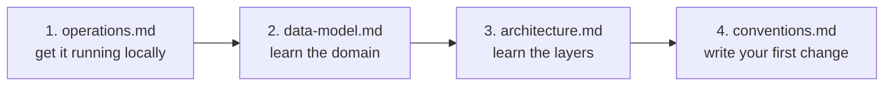

# StonkWatch Documentation

Self-hosted swing-trade watchlist tracker. One ASP.NET Core process serves three
front doors — a Razor Pages UI, a JSON API, and an MCP server — over one Postgres database.

## Read these in order

| Doc | What it answers |
|---|---|
| [architecture.md](architecture.md) | How the pieces fit, request flow, layering rules |
| [data-model.md](data-model.md) | Entities, enums, field meanings, migration workflow |
| [conventions.md](conventions.md) | How to write code here — patterns, naming, PR checklist |
| [api-and-mcp.md](api-and-mcp.md) | Endpoint + tool reference, contract semantics |
| [operations.md](operations.md) | Local setup, config, deploy, runbook |
| [tech-assessment.md](tech-assessment.md) | Is the stack right for the planned features? |

## 15-minute onboarding



1. **Run it** — [operations.md § Local development](operations.md#local-development). ~10 min, needs .NET SDK + Docker.
2. **Learn the domain** — [data-model.md](data-model.md). Everything is a `Candidate` with price levels; `Alert`s watch those levels; `ReviewLogEntry` records what you thought and when.
3. **Learn the layers** — [architecture.md](architecture.md). The one rule: business logic lives in `Services/`, never in an endpoint, page model, or MCP tool.
4. **Make a change** — [conventions.md](conventions.md) has the checklist.

## The one-paragraph version

A single user tracks swing-trade candidates. Data is entered two ways: by hand
through the Razor UI, or by Claude through the MCP server (`"add ASTS as high
priority, watching the $59-60 reclaim"`). Both paths call the same
[`CandidateService`](../src/StonkWatch.Web/Services/CandidateService.cs), which owns all
validation and persistence. An opt-in background worker polls prices during market hours,
compares them to each candidate's levels, and emails a digest when something crosses.
Nothing is multi-tenant and there is exactly one login.

## Project layout

```
StonkWatch/
├── docs/                        ← you are here
├── src/StonkWatch.Web/
│   ├── Auth/                    ← API-key authentication handler
│   ├── Contracts/               ← DTOs + request records (the public shape)
│   ├── Data/                    ← EF Core entities, DbContext, migrations, enums
│   ├── Endpoints/               ← minimal-API route groups under /api/*
│   ├── Mcp/                     ← MCP tool definitions served at /mcp
│   ├── Pages/                   ← Razor Pages UI
│   ├── Services/                ← business logic (the only place it lives)
│   │   ├── MarketData/          ← live quote cache; Questrade/ (watchlist), Twelve Data (monitoring)
│   │   ├── Monitoring/          ← price-check worker, job, level evaluator, calendar
│   │   ├── Notifications/       ← INotifier, SMTP sender, alert digest
│   │   └── Watchlist/           ← live watchlist service, poll worker and job
│   └── wwwroot/                 ← static assets, Bootstrap, jQuery
├── tests/StonkWatch.Web.Tests/  ← xUnit; Testcontainers for database tests
├── docker-compose.dev.yml       ← local Postgres only
└── Dockerfile                   ← production image (the VPS supplies its own run config)
```
