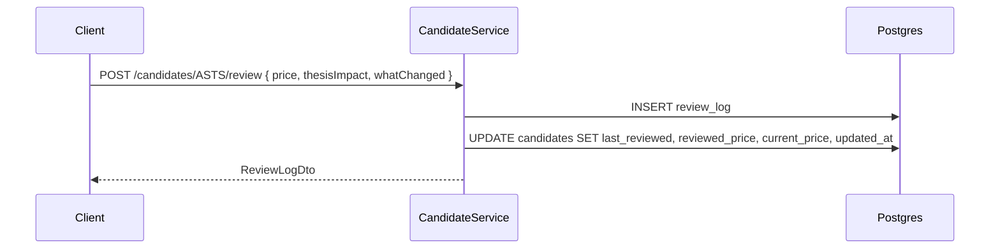

# API Reference

A thin wrapper over
[`CandidateService`](../src/StonkWatch.Web/Services/CandidateService.cs) — it requires the
`X-Api-Key` header and shares the service's validation semantics with the Razor UI.

## Authentication

```
X-Api-Key: <value of Auth:ApiKey>
```

Missing or wrong → `401`. There is no bearer token, no OAuth, no per-client key.

## JSON API

Base: `/api`. All routes require the `ApiKey` policy.

### Candidates

| Method | Route | Body | Returns |
|---|---|---|---|
| `GET` | `/api/candidates?status=&priority=` | — | `CandidateDto[]`, ordered by ticker |
| `GET` | `/api/candidates/{ticker}` | — | `CandidateDetailDto` (candidate + alerts + reviews) |
| `POST` | `/api/candidates` | `CreateCandidateRequest` | `201` + `CandidateDto` |
| `PATCH` | `/api/candidates/{ticker}` | `UpdateCandidateRequest` | `CandidateDto` |
| `DELETE` | `/api/candidates/{ticker}` | — | `204` (cascades to alerts + reviews) |
| `POST` | `/api/candidates/{ticker}/review` | `LogReviewRequest` | `ReviewLogDto` |

### Alerts

| Method | Route | Body | Returns |
|---|---|---|---|
| `GET` | `/api/alerts?triggered=true` | — | `AlertDto[]`, newest `LastChecked` first |
| `POST` | `/api/candidates/{ticker}/alerts` | `CreateAlertRequest` | `AlertDto` |
| `PATCH` | `/api/candidates/{ticker}/alerts/{alertId}` | `UpdateAlertRequest` | `AlertDto` |
| `POST` | `/api/candidates/{ticker}/alerts/{alertId}/acknowledge` | — | `AlertDto` |
| `DELETE` | `/api/candidates/{ticker}/alerts/{alertId}` | — | `204` |

`alertId` is a GUID and route-constrained (`{alertId:guid}`).

Acknowledging marks a triggered alert as seen: it drops off the dashboard and stops sending
reminder emails until the level re-arms and fires afresh.

### Jobs

| Method | Route | Returns |
|---|---|---|
| `GET` | `/api/jobs/{job}/last` | `JobRunDto` for the most recent run, or `404` |

The only job name today is `PriceCheck`.

### Health

| Method | Route | Auth | Returns |
|---|---|---|---|
| `GET` | `/healthz` | **none** | `200 Healthy` / `503` |

Anonymous by design so a proxy or uptime monitor can reach it. It checks Postgres
connectivity and exposes no watchlist data.

### Status codes

| Code | When |
|---|---|
| `200` | success |
| `201` | candidate created (`Location: /candidates/{ticker}`) |
| `204` | deleted |
| `400` | `{ "error": "..." }` — invalid enum value, missing ticker |
| `401` | missing/invalid `X-Api-Key` |
| `404` | ticker or alert not found |
| `409` | `{ "error": "Candidate 'ASTS' already exists." }` |

### Request semantics

**Ticker is the key.** It is trimmed and uppercased on every call — `/api/candidates/asts`
and `/api/candidates/ASTS` are the same resource. Ticker is immutable; to rename, delete
and recreate.

**Enum-ish fields are strings and forgiving.** `"near trigger"`, `"NEAR_TRIGGER"`,
`"Near-Trigger"` all parse to `NearTrigger`. An unrecognised value returns `400` listing
the valid options.

**PATCH is three-way:**

| You send | Effect |
|---|---|
| field omitted / `null` | unchanged |
| `""` (text fields only) | cleared to `null` |
| a value | set |

```jsonc
// Move a ticker to Ready and clear its stale event note
PATCH /api/candidates/ASTS
{ "status": "ready", "nextEvent": "" }
```

**Logging a review has side effects.** `POST /candidates/{ticker}/review` appends a
`review_log` row *and* updates the candidate: `LastReviewed` always;
`ReviewedPrice` + `CurrentPrice` when `price` is supplied.



### Examples

```bash
KEY=your-api-key
BASE=https://your-host

# List everything near a trigger
curl -H "X-Api-Key: $KEY" "$BASE/api/candidates?status=near%20trigger"

# Add a candidate
curl -X POST "$BASE/api/candidates" \
  -H "X-Api-Key: $KEY" -H "Content-Type: application/json" \
  -d '{"ticker":"asts","company":"AST SpaceMobile","priority":"high",
       "status":"watch","supportLow":52,"supportHigh":55,
       "reclaimTrigger1":59,"invalidation":48}'

# Log a review
curl -X POST "$BASE/api/candidates/ASTS/review" \
  -H "X-Api-Key: $KEY" -H "Content-Type: application/json" \
  -d '{"price":57.2,"thesisImpact":"improved","whatChanged":"Held support on volume",
       "nextAction":"Buy the $59 reclaim"}'

# Alerts needing attention
curl -H "X-Api-Key: $KEY" "$BASE/api/alerts?triggered=true"
```
