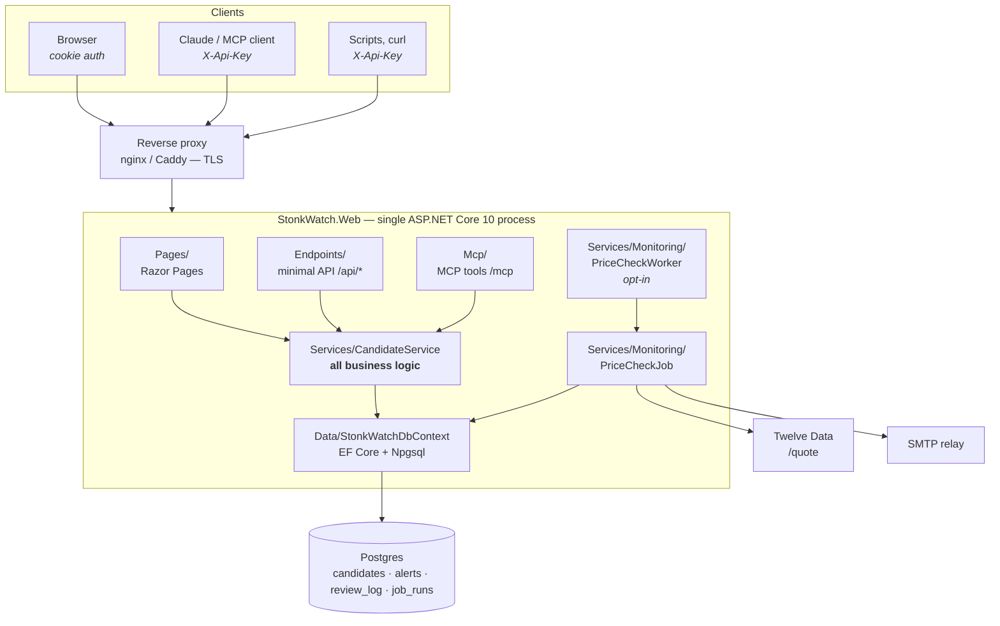
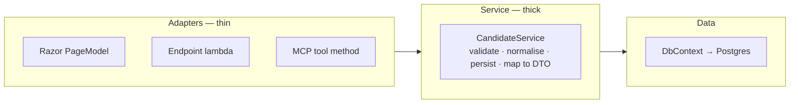
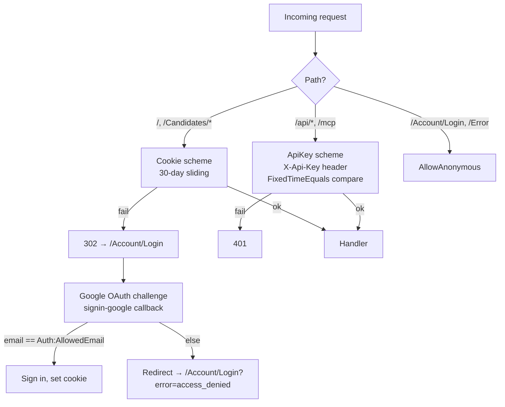
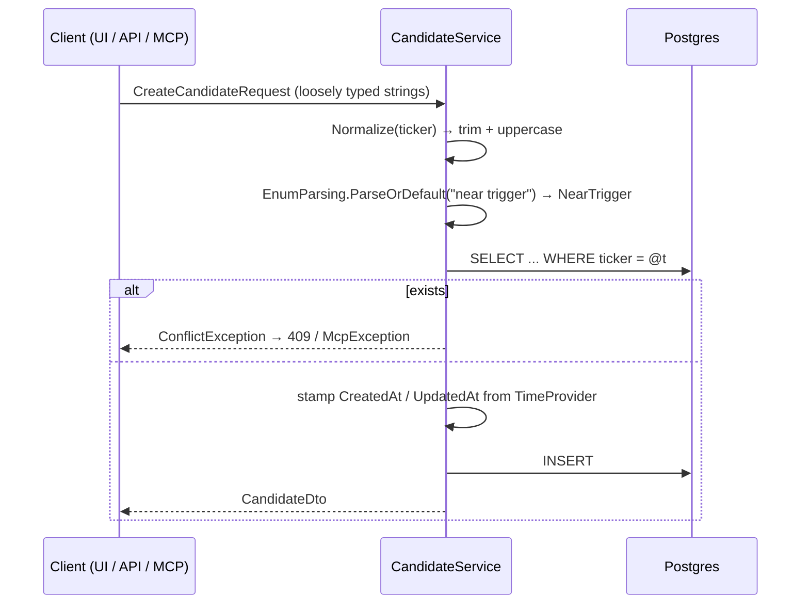
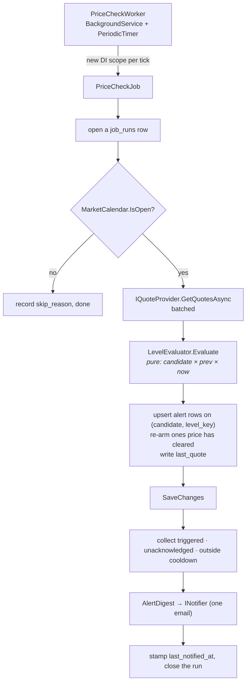
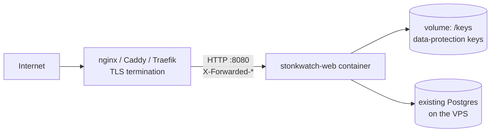

# Architecture

## System view

Everything is one process in one container. There is no message bus, no cache
server, no separate MCP sidecar.

## The layering rule

**Three front doors, one brain.** Razor Pages, the JSON API, and MCP tools are all
thin adapters. They parse input, call `CandidateService`, and shape the response.

| Layer | Allowed to | Never |
|---|---|---|
| `Pages/`, `Endpoints/`, `Mcp/` | Parse input, call a service, map errors to a response | Touch `DbContext`, contain domain rules |
| `Services/` | Validate, normalise, query, persist, map entity → DTO | Know about HTTP, Razor, or MCP |
| `Data/` | Define entities, config, migrations | Contain behaviour |
| `Contracts/` | Define DTOs and request records | Reference entities |

If you find yourself injecting `StonkWatchDbContext` into a `PageModel`, stop — the
logic belongs in a service method that all three front doors can share.

## Authentication

Two schemes coexist, selected per-route.

- Razor Pages: `options.Conventions.AuthorizeFolder("/")` in
  [`Program.cs`](../src/StonkWatch.Web/Program.cs) — everything is protected by default;
  `/Account/Login` and `/Error` opt out explicitly.
- API + MCP: the `"ApiKey"` authorization policy, backed by
  [`ApiKeyAuthenticationHandler`](../src/StonkWatch.Web/Auth/ApiKeyAuthenticationHandler.cs).
  It uses `CryptographicOperations.FixedTimeEquals` — keep it that way.
- **UI sign-in is Google OAuth**, restricted to a single address. `Login.cshtml.cs` issues a
  `Challenge` to the Google scheme; on success `OnCreatingTicket` compares the returned email
  against `Auth:AllowedEmail` (case-insensitive) and calls `context.Fail(...)` for anyone
  else, which routes through `OnRemoteFailure` back to `/Account/Login?error=access_denied`.
- **Single user by design.** No user table, no registration, no roles — Google only proves
  who's signing in; authorization is still config-driven (`Auth:AllowedEmail`).

## Write path — the same for every client

Two design decisions worth knowing:

1. **Loose input, strict storage.** Requests take `string?` for enum-like fields so a
   natural-language MCP call (`"high priority, near trigger"`) works without exact C#
   casing. [`EnumParsing`](../src/StonkWatch.Web/Data/EnumParsing.cs) strips spaces,
   dashes and underscores, then matches case-insensitively.
2. **`TimeProvider` is injected**, never `DateTimeOffset.UtcNow` inside a service. This
   keeps time controllable for the tests we should be writing (see
   [tech-assessment.md](tech-assessment.md#5-no-tests-fix-this-first)).

## Error mapping

Services throw two domain exceptions; each adapter translates them.

| Exception | HTTP endpoint | MCP tool | Razor page |
|---|---|---|---|
| `ValidationException` | `400 { error }` | `McpException` (message preserved) | `ModelState` / `FilterError` |
| `ConflictException` | `409 { error }` | `McpException` | flash message |
| service returns `null` | `404` | `McpException("No candidate found…")` | `NotFound()` |

MCP needs the `Guarded()` wrapper in
[`WatchlistTools.cs`](../src/StonkWatch.Web/Mcp/WatchlistTools.cs) — the SDK replaces
unrecognised exception types with a generic message, so domain errors must be re-thrown
as `McpException` to survive.

## Price monitoring

Opt-in via `Monitoring:Enabled`. With it off, nothing below is registered and the app is
exactly what it was before the feature existed.

Four decisions worth knowing:

1. **The worker only schedules.** All the logic lives in `PriceCheckJob`, which is scoped and
   testable. The worker resolves it through `IServiceScopeFactory` — a singleton holding a
   scoped `DbContext` would fail on the second tick.
2. **`LevelEvaluator` is pure** — no database, no clock, no I/O. It is the highest-consequence
   arithmetic in the app, so it is the cheapest possible thing to test exhaustively.
3. **Alert state is persisted before the email is sent.** If SMTP fails, the run is recorded
   as failed but the crossings survive with `last_notified_at` still null, so the next tick
   retries. This is why notifications are collected from *persisted alert state* rather than
   from this tick's crossings — a crossing can never recur once `last_quote` moves past it.
4. **The first tick for a candidate is always silent.** `Evaluate` returns nothing when the
   previous price is null, so deploying the worker records quotes rather than firing every
   already-breached level on every ticker at once.

Three independent guards stop notification spam: fire only on the transition into a crossed
state; re-arm only once price moves `ReArmPercent` clear of the level; and never notify the
same alert twice within `MinNotifyHours`. Acknowledging an alert silences it until it re-arms.

## Deployment topology

The container serves plain HTTP and trusts `X-Forwarded-*` from any source — safe only
because it is never exposed directly. Data-protection keys must be persisted to the
volume, or every restart signs the user out.
