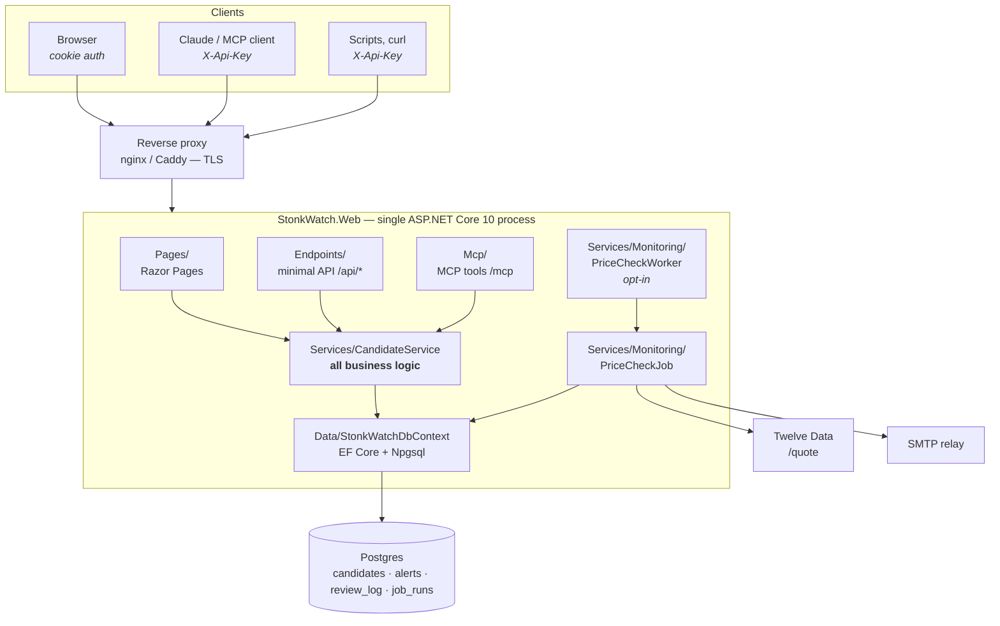
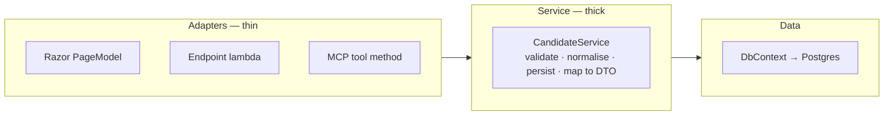
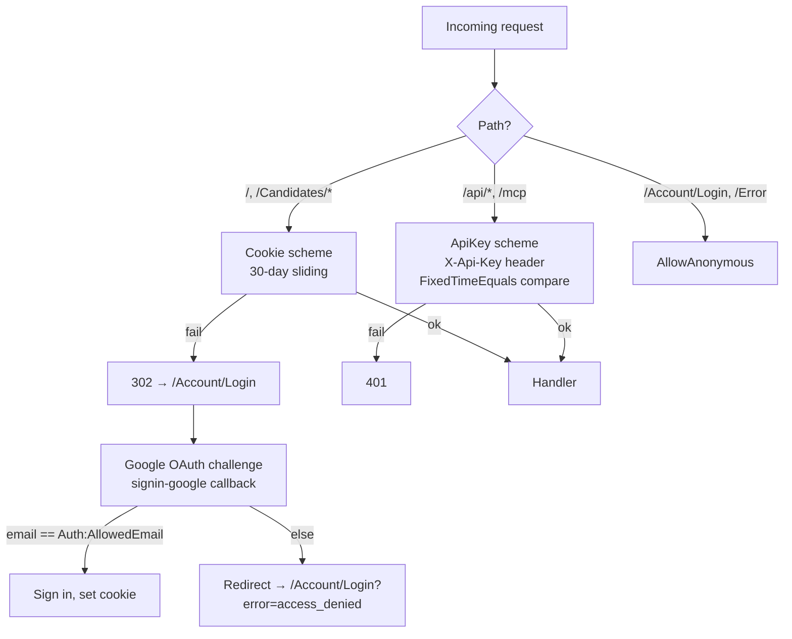
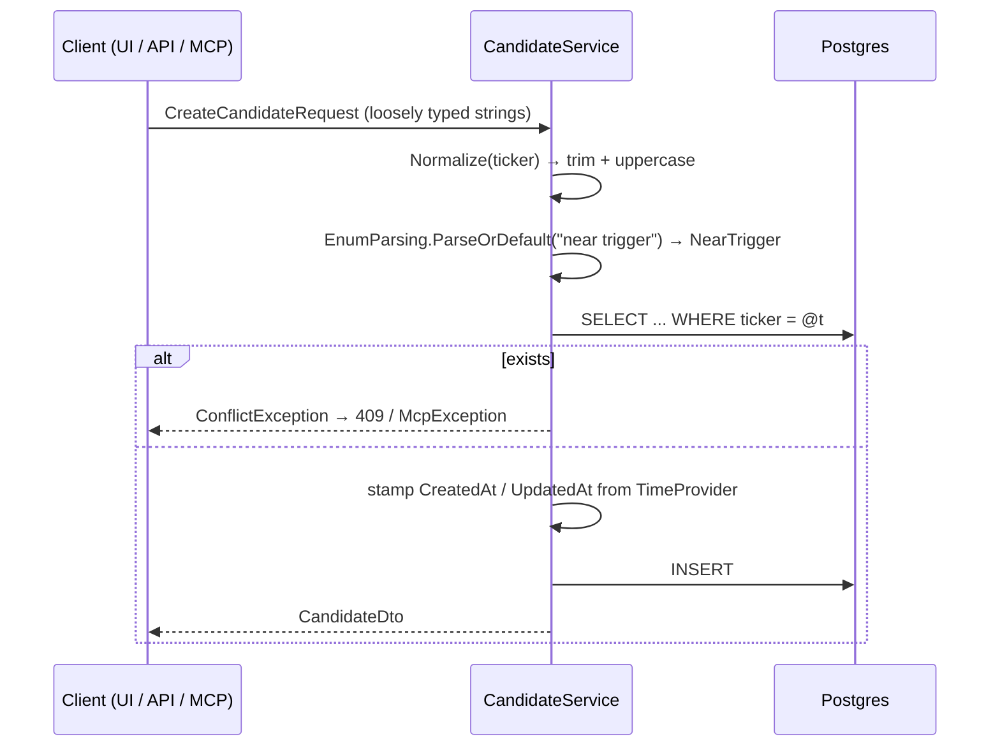
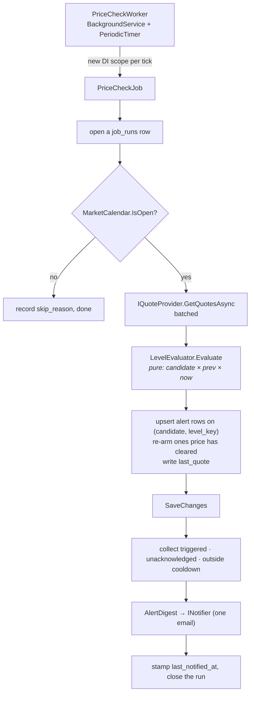
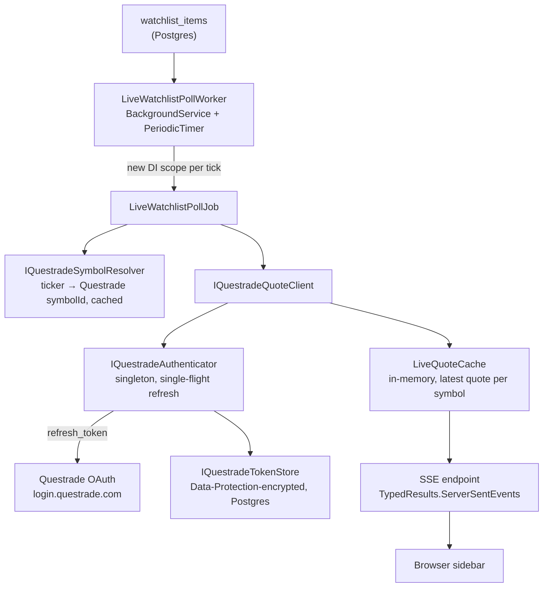
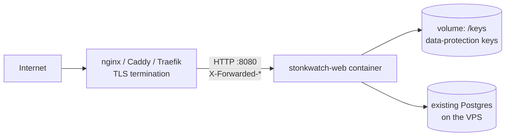

# Architecture

## System view

Everything is one process in one container. There is no message bus, no cache
server, no separate MCP sidecar.

## The layering rule

**Three front doors, one brain.** Razor Pages, the JSON API, and MCP tools are all
thin adapters. They parse input, call `CandidateService`, and shape the response.

| Layer | Allowed to | Never |
|---|---|---|
| `Pages/`, `Endpoints/`, `Mcp/` | Parse input, call a service, map errors to a response | Touch `DbContext`, contain domain rules |
| `Services/` | Validate, normalise, query, persist, map entity → DTO | Know about HTTP, Razor, or MCP |
| `Data/` | Define entities, config, migrations | Contain behaviour |
| `Contracts/` | Define DTOs and request records | Reference entities |

If you find yourself injecting `StonkWatchDbContext` into a `PageModel`, stop — the
logic belongs in a service method that all three front doors can share.

## Authentication

Two schemes coexist, selected per-route.

- Razor Pages: `options.Conventions.AuthorizeFolder("/")` in
  [`Program.cs`](../src/StonkWatch.Web/Program.cs) — everything is protected by default;
  `/Account/Login` and `/Error` opt out explicitly.
- API + MCP: the `"ApiKey"` authorization policy, backed by
  [`ApiKeyAuthenticationHandler`](../src/StonkWatch.Web/Auth/ApiKeyAuthenticationHandler.cs).
  It uses `CryptographicOperations.FixedTimeEquals` — keep it that way.
- **UI sign-in is Google OAuth**, restricted to a single address. `Login.cshtml.cs` issues a
  `Challenge` to the Google scheme; on success `OnCreatingTicket` compares the returned email
  against `Auth:AllowedEmail` (case-insensitive) and calls `context.Fail(...)` for anyone
  else, which routes through `OnRemoteFailure` back to `/Account/Login?error=access_denied`.
- **Single user by design.** No user table, no registration, no roles — Google only proves
  who's signing in; authorization is still config-driven (`Auth:AllowedEmail`).

## Write path — the same for every client

Two design decisions worth knowing:

1. **Loose input, strict storage.** Requests take `string?` for enum-like fields so a
   natural-language MCP call (`"high priority, near trigger"`) works without exact C#
   casing. [`EnumParsing`](../src/StonkWatch.Web/Data/EnumParsing.cs) strips spaces,
   dashes and underscores, then matches case-insensitively.
2. **`TimeProvider` is injected**, never `DateTimeOffset.UtcNow` inside a service. This
   keeps time controllable for the tests we should be writing (see
   [tech-assessment.md](tech-assessment.md#5-no-tests-fix-this-first)).

## Error mapping

Services throw two domain exceptions; each adapter translates them.

| Exception | HTTP endpoint | MCP tool | Razor page |
|---|---|---|---|
| `ValidationException` | `400 { error }` | `McpException` (message preserved) | `ModelState` / `FilterError` |
| `ConflictException` | `409 { error }` | `McpException` | flash message |
| service returns `null` | `404` | `McpException("No candidate found…")` | `NotFound()` |

MCP needs the `Guarded()` wrapper in
[`WatchlistTools.cs`](../src/StonkWatch.Web/Mcp/WatchlistTools.cs) — the SDK replaces
unrecognised exception types with a generic message, so domain errors must be re-thrown
as `McpException` to survive.

## Price monitoring

Opt-in via `Monitoring:Enabled`. With it off, nothing below is registered and the app is
exactly what it was before the feature existed.

Four decisions worth knowing:

1. **The worker only schedules.** All the logic lives in `PriceCheckJob`, which is scoped and
   testable. The worker resolves it through `IServiceScopeFactory` — a singleton holding a
   scoped `DbContext` would fail on the second tick.
2. **`LevelEvaluator` is pure** — no database, no clock, no I/O. It is the highest-consequence
   arithmetic in the app, so it is the cheapest possible thing to test exhaustively.
3. **Alert state is persisted before the email is sent.** If SMTP fails, the run is recorded
   as failed but the crossings survive with `last_notified_at` still null, so the next tick
   retries. This is why notifications are collected from *persisted alert state* rather than
   from this tick's crossings — a crossing can never recur once `last_quote` moves past it.
4. **The first tick for a candidate is always silent.** `Evaluate` returns nothing when the
   previous price is null, so deploying the worker records quotes rather than firing every
   already-breached level on every ticker at once.

Three independent guards stop notification spam: fire only on the transition into a crossed
state; re-arm only once price moves `ReArmPercent` clear of the level; and never notify the
same alert twice within `MinNotifyHours`. Acknowledging an alert silences it until it re-arms.

## Live watchlist (Questrade)

Opt-in via `Questrade:Enabled` (auth, quotes, symbol resolution) and, separately,
`LiveWatchlist:Enabled` (the poll worker). With either off, the corresponding pieces below
are not registered and `/api/questrade/*` doesn't exist. This is a second, independent market
data path — it shares nothing at runtime with Tier 1 price monitoring, which polls Twelve
Data on its own schedule for its own purpose (level-crossing alerts, not live display).

Worth knowing:

1. **`IQuestradeAuthenticator` and `IQuestradeSymbolResolver` are singletons**, not scoped —
   both cache state (the live session; resolved symbol IDs) across the whole poll loop, not
   per tick. `IQuestradeAuthenticator` reaches the scoped `IQuestradeTokenStore` through
   `IServiceScopeFactory`, the same pattern `PriceCheckWorker` uses to reach a scoped
   `DbContext` from a singleton-shaped background loop.
2. **The refresh token is the one secret this app persists**, not just configures — see
   [conventions.md](conventions.md#security) for why that's the documented exception, and
   [operations.md](operations.md#questrade-live-watchlist) for the two recovery paths when it
   dies.
3. **`QuestradeReauthorizationRequiredException` is non-fatal to the poll worker.** A dead
   token means that tick's quotes are stale, not that the worker should stop — the next tick
   tries again, and `/api/questrade/status` is what surfaces the problem to a human.
4. **The `/api/questrade/authorize` and `/status` endpoints never return a session value** —
   only `connected: bool` and, on `/status`, a fixed non-token `reason` string. The access
   token and `api_server` never leave `IQuestradeAuthenticator`.

### The sidebar

`Pages/Shared/_WatchlistSidebar.cshtml` renders a shell only — a header, a column strip, an
empty body and a status line. Every row is built by `wwwroot/js/watchlist.js`, so the initial
paint and every live update go through one code path instead of two that can disagree.

`_Layout.cshtml` includes both **only for signed-in users**: every `/api/watchlist` route is
authenticated, so an anonymous visitor would get a panel stuck on "Loading…" and a 401 loop.
The login page uses `_LoginLayout.cshtml` and never sees it.

The script does a `GET /api/watchlist` for the full view, then opens an `EventSource` on
`/api/watchlist/stream` and patches rows in place. Four things about it are deliberate:

- **The browser never contacts Questrade.** It only calls this app's own routes, on the session
  cookie. No provider name, key, or token appears anywhere in the markup, CSS, or script.
- **A missing value renders `—`, never `0`.** The opening burst can arrive with every price
  null — the poller does nothing while nobody has the sidebar open — and a null `changePercent`
  is tinted neither green nor red. `0.00%` claims "flat today", which is a different fact.
- **The `ping` keepalive is ignored on purpose.** It carries `null`, not a row; a listener that
  parsed it as a quote would throw on the first property access.
- **A 503 is a state, not a fault.** With the feature switched off the stream never opens; the
  `EventSource` closes for good rather than retrying, and the status line says "live prices
  off" with a neutral dot instead of reconnecting forever behind a red one.

The `+` in the header opens a search box over the list. Typing debounces onto
`GET /api/watchlist/search?q=`, which asks Questrade for prefix matches through
`IQuestradeSymbolSearch`; choosing one — or pressing Enter on a bare ticker — `POST`s to
`/api/watchlist/items`, and the row's `x` `DELETE`s it. Three things about the search are
deliberate:

- **It offers only what the poller can price.** Search and `QuestradeSymbolResolver` share one
  venue list, `QuestradeExchanges.Us`. Were they to drift, search would offer a TSX listing the
  resolver then refuses, and the row would sit at `—` forever with nothing explaining why.
- **An exact-ticker match primes the resolver.** A search that found the symbol is proof it
  exists, which is exactly the evidence a stale negative-cache entry lacks — without priming, a
  transient empty response blacklists a real ticker for half an hour and re-adding it still
  shows nothing. Prefix neighbours are never primed: the positive cache lives as long as the
  process, and priming every match would grow it from keystrokes.
- **An upstream failure is a `503`, never an empty list.** The poller answers a bad tick with
  "nothing this time"; here that would render a Questrade outage as "no such symbol". The
  `503` body is fixed text — the exception's own message could carry a token or an `api_server`
  URL. With Questrade switched off the route says so rather than 404ing, and the box still
  adds a typed ticker.

Row clicks do nothing yet — rows are focusable and semantic so that wiring them later is a
behaviour change, not a rebuild.

## Deployment topology

The container serves plain HTTP and trusts `X-Forwarded-*` from any source — safe only
because it is never exposed directly. Data-protection keys must be persisted to the
volume, or every restart signs the user out.
