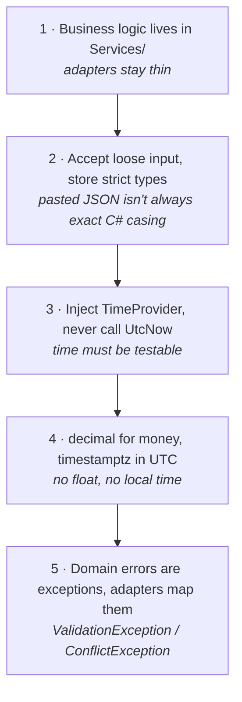
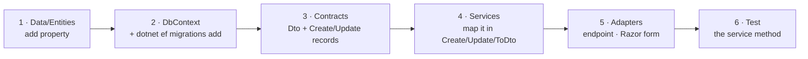

# Coding Conventions

The goal: a change should be indistinguishable from the code around it.

## The five rules that matter



## C# style

The project is `net10.0` with `Nullable` and `ImplicitUsings` enabled. Follow what is
already there:

```csharp
// Primary constructors for DI — no private readonly fields, no assignment boilerplate
public class CandidateService(StonkWatchDbContext db, TimeProvider timeProvider)
{
    // Expression-bodied members for one-liners
    private static string Normalize(string ticker) => ticker.Trim().ToUpperInvariant();

    // Collection expressions
    public List<Alert> Alerts { get; set; } = [];

    // Async all the way down, always take a CancellationToken with a default
    public async Task<CandidateDto?> GetAsync(string ticker, CancellationToken ct = default)
    {
        // AsNoTracking for reads you won't mutate
        var candidate = await db.Candidates.AsNoTracking()
            .FirstOrDefaultAsync(c => c.Ticker == Normalize(ticker), ct);
        return candidate is null ? null : ToDto(candidate);
    }
}
```

| Do | Don't |
|---|---|
| `is null` / `is not null` | `== null` |
| `switch` expressions for small maps | if/else ladders |
| `required` on non-nullable entity props | nullable-forgiving `= null!` |
| `AsNoTracking()` on read-only queries | tracking everything |
| Records for DTOs and requests | classes with settable properties |

### Comments

Comment **why**, never **what**. The existing comments are the model:

```csharp
// Npgsql only accepts UTC-normalized DateTimeOffset values for timestamptz columns.
var reviewDate = (request.ReviewDate ?? timeProvider.GetUtcNow()).ToUniversalTime();
```

That earns its place — it explains a non-obvious constraint. `// get the candidate` does not.
Use XML doc comments (`/// <summary>`) only where the contract is subtle, as on
`EnumParsing` and `UpdateCandidateRequest`.

## Contracts

`Contracts/` defines the public shape of the app. Three record types per concept:

| Type | Purpose | Rule |
|---|---|---|
| `XxxDto` | What we return | Enums as `string` (already `.ToString()`d). Never expose entities. |
| `CreateXxxRequest` | What we accept on POST | Every field optional except the natural key; enum-ish fields are `string?`. |
| `UpdateXxxRequest` | What we accept on PATCH | Every field optional, all default `null`. |

**PATCH semantics are load-bearing** — document and preserve them:

- `null` (omitted) → leave the existing value unchanged
- `""` (empty string) → clear a nullable text field to `null`
- any other value → set it

That three-way logic lives in one place, `MergeString` in `CandidateService`. Use it;
don't reimplement `??` inline for text fields.

```csharp
private static string? MergeString(string? incoming, string? current) => incoming switch
{
    null => current,   // omitted
    "" => null,        // explicit clear
    _ => incoming      // set
};
```

Numeric and date fields use plain `??` — there is no "clear" sentinel for them today. If
you need one, add it deliberately and document it in the request record's XML comment.

## Adding a feature — the standard path

Adding a field or capability usually touches the same six places in the same order:



Skipping step 4 is the usual bug: the field exists in the DTO but nothing writes it.

### Adding an endpoint

Endpoints are extension methods on `IEndpointRouteBuilder`, grouped and authorised once:

```csharp
public static void MapThingEndpoints(this IEndpointRouteBuilder app)
{
    var group = app.MapGroup("/api/things").RequireAuthorization("ApiKey");

    group.MapGet("/{id}", async (string id, ThingService service, CancellationToken ct) =>
    {
        var thing = await service.GetAsync(id, ct);
        return thing is null ? Results.NotFound() : Results.Ok(thing);
    });
}
```

Register it in `Program.cs` next to the others. Return `Results.NotFound()` for a missing
resource, `Results.BadRequest(new { error })` for `ValidationException`,
`Results.Conflict(new { error })` for `ConflictException`, `Results.NoContent()` for a
successful delete.

### Adding a Razor page

- Page models use primary-constructor DI and inject a **service**, never the `DbContext`.
- `[BindProperty(SupportsGet = true)]` for filter/query state.
- POST handlers are `OnPost<Name>Async`, set `TempData["Flash"]`, and `RedirectToPage`
  preserving the current filters (PRG pattern — see `Pages/Candidates/Index.cshtml.cs`).
- Everything is authorised by default; nothing to add.

## Database access

- Query through `CandidateService`, not from adapters.
- `AsNoTracking()` for reads; tracked queries only when you're about to mutate.
- Use `.Include()` deliberately — `GetByTickerAsync` includes alerts and review logs
  because the detail page needs them; the list query includes nothing.
- Filter in the database (`.Where(...)` before `ToListAsync`), sort/project in memory only
  when the source is already materialised.
- One `SaveChangesAsync` per logical operation.

## Testing

`tests/StonkWatch.Web.Tests` (xUnit). Run with `dotnet test`.

| Kind | How | Use for |
|---|---|---|
| Pure unit | no fixture | `LevelEvaluator`, `AlertDigest`, `MarketCalendar`, `EnumParsing` |
| Database | `[Collection(PostgresCollection.Name)]` + `PostgresFixture` | `CandidateService`, `PriceCheckJob` |
| HTTP | `StubHttpMessageHandler` | `TwelveDataQuoteProvider` |

- **Use a real Postgres**, never the EF in-memory provider — it reproduces neither
  `timestamptz` UTC enforcement nor `numeric(18,4)` rounding, which is exactly what these
  tests are for. `PostgresFixture` starts one container per run via Testcontainers; Docker
  must be running.
- **`FakeTimeProvider`** (`Microsoft.Extensions.Time.Testing`) for anything time-dependent.
  This is why services take `TimeProvider` rather than calling `UtcNow`.
- **Fakes over mocking libraries** — `FakeQuoteProvider` and `RecordingNotifier` in
  `Fakes.cs`. No Moq/NSubstitute dependency.
- **Keep new logic pure where you can.** `LevelEvaluator` takes a candidate and two prices
  and returns crossings; that shape is why it can be tested exhaustively for the cost of a
  few lines each.

## Naming

| Thing | Convention | Example |
|---|---|---|
| Entity | singular | `Candidate`, `Alert` |
| Table | plural snake_case | `candidates`, `review_log` |
| `DbSet` | plural | `Candidates`, `ReviewLogs` |
| Service method | `VerbNounAsync` | `LogReviewAsync`, `GetByTickerAsync` |
| Endpoint route | plural, kebab if needed | `/api/candidates/{ticker}/alerts` |
| Migration | `PascalCaseDescription` | `AddQuoteHistory` |

## Security

- Never log or return `Auth:ApiKey`, `Auth:Google:ClientSecret`, or the connection string.
- Compare secrets with `CryptographicOperations.FixedTimeEquals`, never `==`.
- Secrets come from configuration (`user-secrets` locally, env vars in Docker). Nothing
  sensitive goes in `appsettings.json`.
- Razor forms get antiforgery tokens automatically — don't disable it.
- If you add an outbound HTTP client, the API key stays server-side. Never render a
  third-party key into a page or expose it to JavaScript.

**One documented exception**: the Questrade refresh token. It's rotating and single-use — every
refresh consumes it and returns a new one — so, unlike every other secret, it cannot live in
configuration; the running app is the only thing that ever sees the current value. It is
persisted, encrypted at rest via ASP.NET Core Data Protection (`QuestradeTokenStore`), and
that persistence is the *only* thing that's allowed to happen to it: it must never be logged,
echoed back in a response, or appear in an exception message, in success or failure. If you
add another credential that has to rotate the same way, follow this shape rather than putting
it in configuration.

## Pull request checklist

- [ ] Business logic is in `Services/`, not in an adapter
- [ ] New/changed columns are in the `HasPrecision(18, 4)` loop if they hold money
- [ ] Migration added, and the model snapshot is committed with it
- [ ] `TimeProvider` used instead of `DateTimeOffset.UtcNow`
- [ ] `CancellationToken` threaded through new async methods
- [ ] PATCH fields follow the null/empty/value semantics
- [ ] No secrets in code, logs, or `appsettings.json`
- [ ] `dotnet build` clean — no new warnings
- [ ] `dotnet test` green, with a test for any non-trivial logic
