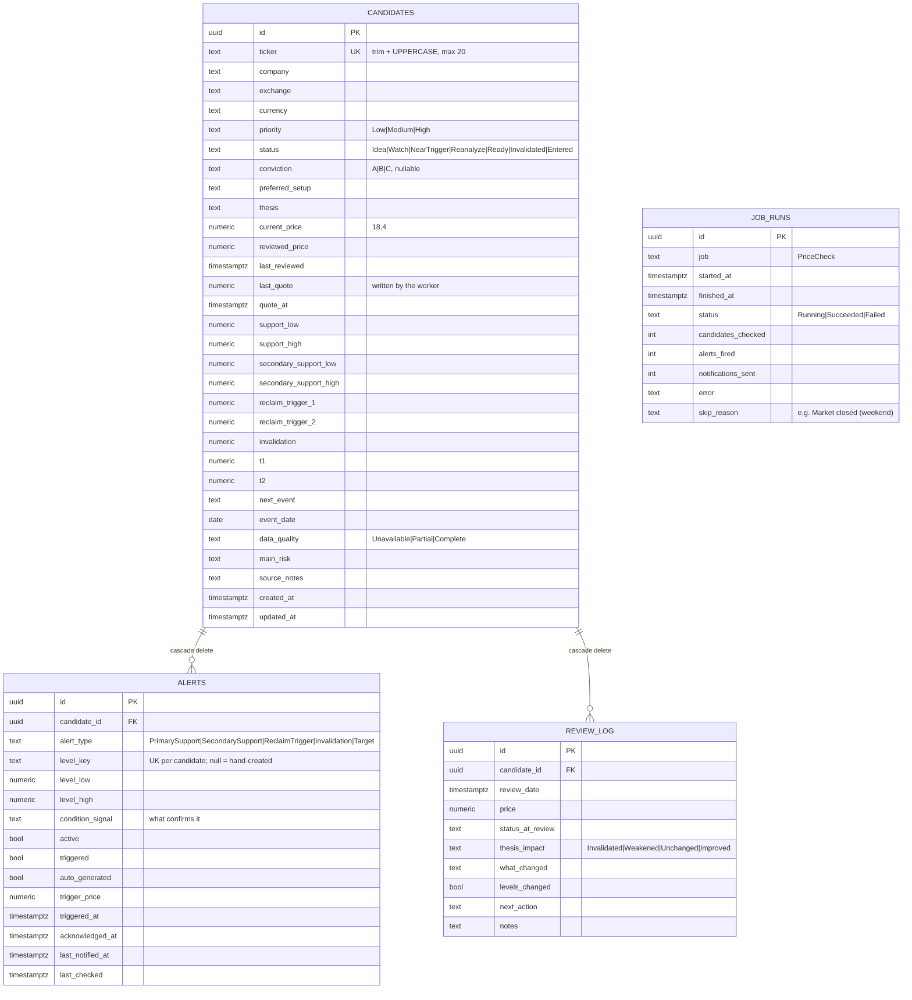
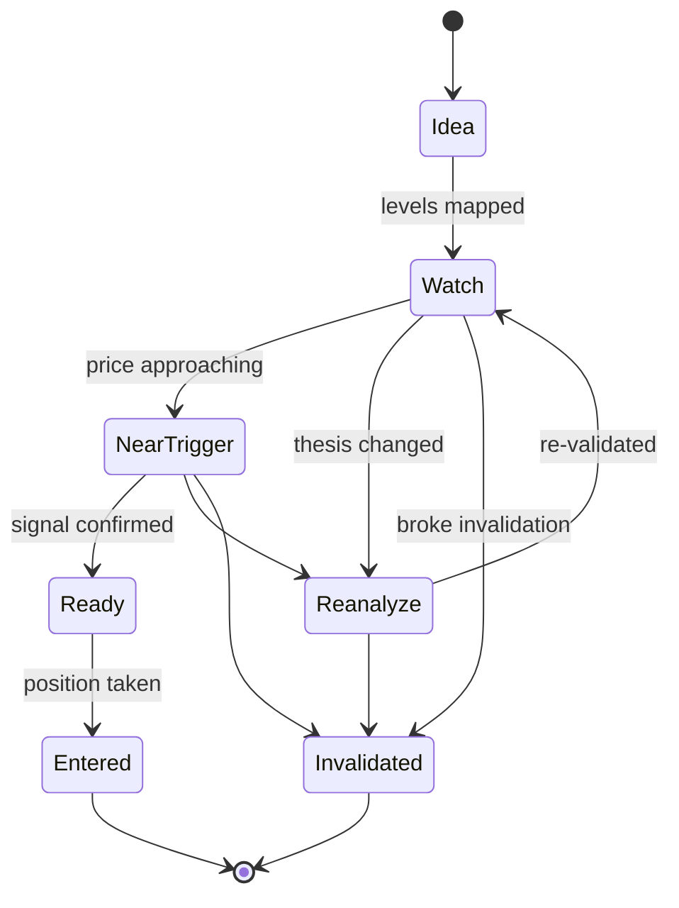

# Data Model

Four tables, all snake_case in Postgres (via `EFCore.NamingConventions`), all keyed by
`uuid`. Enums are stored as **strings**, not ints — readable in `psql`, and safe to
reorder in C#.



## The price levels, visually

This is the heart of the domain. A candidate is a bet that price does something specific
around known levels.

```
   price
     │
  T2 ┤ ─────────────  target 2
     │
  T1 ┤ ─────────────  target 1
     │
 RT2 ┤ ─ ─ ─ ─ ─ ─ ─  reclaim trigger 2   ← breaking up through = thesis confirming
 RT1 ┤ ─ ─ ─ ─ ─ ─ ─  reclaim trigger 1
     │
     ┤ ▓▓▓▓▓▓▓▓▓▓▓▓▓  support_high
     │ ▓ primary   ▓                       ← the zone you want to buy into
     ┤ ▓▓▓▓▓▓▓▓▓▓▓▓▓  support_low
     │
     ┤ ░░░░░░░░░░░░░  secondary_support_high
     │ ░ secondary ░                       ← the "if that fails" zone
     ┤ ░░░░░░░░░░░░░  secondary_support_low
     │
 INV ┤ ═════════════  invalidation         ← below here the thesis is dead
     │
```

Every level is nullable — a candidate at `Idea` status may have nothing but a ticker.
`DataQuality` records how complete the picture is (`Unavailable` → `Partial` → `Complete`).

## Status lifecycle

`CandidateStatus` is not enforced as a state machine in code — any transition is legal —
but this is the intended flow:



`Invalidated` and `Entered` are terminal for dashboard purposes — the stale-review widget
in [`Pages/Index.cshtml.cs`](../src/StonkWatch.Web/Pages/Index.cshtml.cs) excludes them.

## Enum reference

All live in [`Data/Enums.cs`](../src/StonkWatch.Web/Data/Enums.cs). Stored as strings with
an explicit `HasMaxLength`.

| Enum | Values | Notes |
|---|---|---|
| `Priority` | `Low`, `Medium`, `High` | defaults to `Medium` |
| `CandidateStatus` | `Idea`, `Watch`, `NearTrigger`, `Reanalyze`, `Ready`, `Invalidated`, `Entered` | defaults to `Idea` |
| `Conviction` | `C`, `B`, `A` | nullable — ordered worst → best deliberately |
| `DataQuality` | `Unavailable`, `Partial`, `Complete` | defaults to `Unavailable` |
| `ThesisImpact` | `Invalidated`, `Weakened`, `Unchanged`, `Improved` | review log only |
| `AlertType` | `PrimarySupport`, `SecondarySupport`, `ReclaimTrigger` | |

Callers never need exact casing —
[`EnumParsing.ParseOrDefault`](../src/StonkWatch.Web/Data/EnumParsing.cs) accepts
`"near trigger"`, `"NEAR_TRIGGER"`, `"Near-Trigger"`.

## Field semantics worth knowing

| Field | Meaning |
|---|---|
| `ticker` | **The natural key.** Unique index; always `Trim().ToUpperInvariant()`. Routes use it, not the GUID. |
| `current_price` | Price as of the last **review**. Only a review writes it. |
| `reviewed_price` | Price at the last review — lets you see drift since you last looked. |
| `last_quote` / `quote_at` | Last price from the **market data provider**. Deliberately separate from `current_price` so the worker and your reviews never overwrite each other. Also serves as the "previous price" the evaluator compares against next tick. |
| `last_reviewed` | Drives the "needs review" dashboard (stale after 14 days). |
| `alerts.level_key` | Which candidate level produced the alert (`Invalidation`, `SupportZone`, `ReclaimTrigger1`, `T2`, …). **Null means a human created it**, and the worker never touches those. Unique per candidate, which is how the worker upserts. |
| `alerts.triggered` | Set by the worker on a crossing; cleared when price moves back past the level by `Monitoring:ReArmPercent`. Still hand-toggleable in the UI. |
| `alerts.acknowledged_at` | You've seen it. Removes it from the dashboard and stops reminder emails until it re-arms and fires again. |
| `alerts.last_notified_at` | Enforces the `Monitoring:MinNotifyHours` cooldown. Stays null if the email failed, so the next tick retries. |
| `alerts.condition_signal` | Free text: what confirms the level, e.g. "daily close above with volume". |
| `review_log.levels_changed` | Did this review move the support/trigger/target numbers? |
| `job_runs.skip_reason` | Why a tick did nothing — "Market closed (weekend)", "No candidates with levels to monitor". A skipped run still counts as `Succeeded`. |

> **Remaining gap.** There is still no price history table, so charts and sparklines aren't
> possible yet — the crossing logic only needs the previous quote, which lives on the
> candidate. Add `quote_history` when building the live watchlist.

## Migration workflow

Migrations live in `Data/Migrations/`. From `src/StonkWatch.Web`:

```bash
dotnet ef migrations add DescriptiveName   # after changing entities or OnModelCreating
dotnet ef database update                  # apply locally
dotnet ef migrations remove                # undo the last one, if not yet applied anywhere
```

Rules:

- **Never edit an applied migration.** Add a new one.
- **Always commit the `.Designer.cs` and the updated `StonkWatchDbContextModelSnapshot.cs`** —
  EF uses the snapshot to diff the next migration.
- **Review the generated SQL** before committing. EF will happily drop a column it thinks
  you renamed.
- Migrations are **not** applied automatically at startup. Production applies them
  deliberately — see [operations.md](operations.md#applying-migrations).

## Conventions baked into the schema

- **Decimals are `numeric(18,4)`** — configured in a loop in
  [`StonkWatchDbContext.OnModelCreating`](../src/StonkWatch.Web/Data/StonkWatchDbContext.cs).
  Add a new price column? Add it to that loop. Never use `double`/`float` for money.
- **Timestamps are `timestamptz`** and Npgsql only accepts UTC-normalised
  `DateTimeOffset`. Call `.ToUniversalTime()` on anything coming from a client — see
  `LogReviewAsync`.
- **Cascade delete** from candidate to alerts and review log. Deleting a ticker deletes
  its history; that is intentional for a personal tool.
