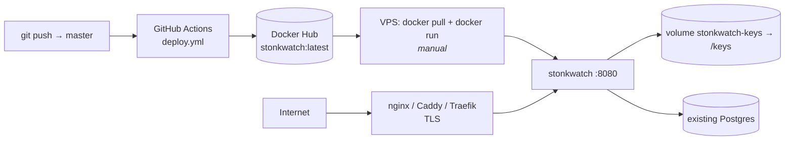

# Operations

## Local development

Prerequisites: .NET 10 SDK, Docker.

```bash
# 1. Postgres for development only
docker compose -f docker-compose.dev.yml up -d      # localhost:5432

# 2. Secrets (stored outside the repo, in the user profile)
cd src/StonkWatch.Web
dotnet user-secrets set "ConnectionStrings:StonkWatch" \
  "Host=localhost;Port=5432;Database=stonkwatch;Username=stonkwatch;Password=devpassword"
dotnet user-secrets set "Auth:Google:ClientId" "<from Google Cloud Console>"
dotnet user-secrets set "Auth:Google:ClientSecret" "<from Google Cloud Console>"
dotnet user-secrets set "Auth:AllowedEmail" "you@gmail.com"
dotnet user-secrets set "Auth:ApiKey" "<any random string>"

# 3. Schema + run
dotnet ef database update
dotnet run
```

Creating the Google OAuth client (one-time, in the
[Google Cloud Console](https://console.cloud.google.com/apis/credentials)):

1. Create a project (or reuse one), then **Create Credentials → OAuth client ID → Web
   application**.
2. Add an **Authorized redirect URI** for every environment that will sign in:
   - Local dev: `http://localhost:5264/signin-google` (or whatever port `dotnet run` binds)
   - Production: `https://your-vps-host/signin-google`
3. Copy the generated Client ID and Client secret into `Auth:Google:ClientId` /
   `Auth:Google:ClientSecret` above. `Auth:AllowedEmail` is the one Google account permitted
   to sign in — anyone else's Google login is rejected after the OAuth round-trip.

If `dotnet ef` is missing: `dotnet tool install --global dotnet-ef`.

## Configuration

All configuration comes from environment variables or `dotnet user-secrets`. In env vars,
`__` replaces `:` — `ConnectionStrings:StonkWatch` becomes `ConnectionStrings__StonkWatch`.

| Key | Required | Purpose |
|---|---|---|
| `ConnectionStrings:StonkWatch` | ✅ | Npgsql connection string. App fails fast at startup without it. |
| `Auth:Google:ClientId` | ✅ | OAuth client ID from Google Cloud Console |
| `Auth:Google:ClientSecret` | ✅ | OAuth client secret from Google Cloud Console |
| `Auth:AllowedEmail` | ✅ | The one Google account allowed to sign in; every other Google login is rejected |
| `Auth:ApiKey` | ✅ | Shared secret for `/api/*` and `/mcp` |
| `DataProtectionKeysPath` | in containers, and whenever Questrade is enabled | Directory for cookie/antiforgery keys, and the only thing that lets the encrypted Questrade refresh token survive a restart. Unset in a container ⇒ everyone is signed out on every restart. Unset with `Questrade:Enabled=true` ⇒ the app refuses to start (see Questrade below). |

Nothing sensitive belongs in `appsettings.json` — it is committed.

### Price monitoring

All optional. **`Monitoring:Enabled` is `false` by default**, and with it off none of the rest
is read, no HTTP client is registered, and no worker runs — the app behaves exactly as it did
before the feature existed. That default also means a developer running locally can never
email anyone by accident.

| Key | Default | Purpose |
|---|---|---|
| `Monitoring:Enabled` | `false` | Master switch for the price-check worker |
| `Monitoring:IntervalMinutes` | `15` | Tick cadence |
| `Monitoring:IgnoreMarketHours` | `false` | Poll outside the session window. **Local testing only.** |
| `Monitoring:ReArmPercent` | `0.5` | How far past a level price must move before that alert can fire again |
| `Monitoring:MinNotifyHours` | `6` | Minimum gap between two emails about the same alert |
| `MarketData:ApiKey` | — | Twelve Data API key. Required when monitoring is on. |
| `MarketData:BaseUrl` | `https://api.twelvedata.com/` | |
| `MarketData:BatchSize` | `20` | Symbols per request. Batching is what keeps a 40-ticker list inside the free tier. |
| `Smtp:Host` / `Smtp:Port` | — / `587` | |
| `Smtp:Security` | `Auto` | `Auto`, `StartTls` (587), `SslOnConnect` (465), or `None` (local sink only) |
| `Smtp:Username` / `Smtp:Password` | — | A Gmail app password works |
| `Smtp:From` / `Smtp:To` | — | Required when monitoring is on |
| `App:PublicBaseUrl` | — | Absolute base URL for the links in alert emails, e.g. `https://stonks.example.com` |

`MarketData:*` and `Smtp:*` are validated **at startup** when monitoring is enabled, so a
missing API key or `From` address fails the deploy rather than the first tick.

Trying it locally without sending real email — run a throwaway mail sink and point at it:

```bash
docker run -d --name mailpit -p 1025:1025 -p 8025:8025 axllent/mailpit   # UI on :8025
dotnet user-secrets set "Monitoring:Enabled" "true"
dotnet user-secrets set "Monitoring:IntervalMinutes" "1"
dotnet user-secrets set "Monitoring:IgnoreMarketHours" "true"
dotnet user-secrets set "Smtp:Host" "localhost"
dotnet user-secrets set "Smtp:Port" "1025"
dotnet user-secrets set "Smtp:Security" "None"
```

### Questrade (live watchlist)

All optional. **`Questrade:Enabled` is `false` by default**, and with it off none of
`IQuestradeAuthenticator`, `IQuestradeSymbolResolver`, `IQuestradeQuoteClient`, or the poll
worker is registered, and `/api/questrade/*` doesn't exist (a request to it 404s, the same as
any other unmapped route) — the app behaves exactly as it did before the feature existed.

| Key | Default | Purpose |
|---|---|---|
| `Questrade:Enabled` | `false` | Master switch for Questrade auth, the symbol resolver, the quote client, and (if `LiveWatchlist:Enabled` is also true) the poll worker |
| `Questrade:LoginUrl` | `https://login.questrade.com/oauth2/token` | Questrade's OAuth token endpoint. Only worth changing in tests. |
| `Questrade:BootstrapRefreshToken` | — | The fallback recovery path — see below. Not needed for day-to-day use once a token is stored. |
| `DataProtectionKeysPath` | — | **Required** when `Questrade:Enabled` is true. The app fails fast at startup if it's missing — see "Why the app refuses to start" below. |

**Getting a first refresh token**, once, from the
[Questrade portal](https://login.questrade.com/APIAccess/UserApps.aspx): App Hub → generate a
personal app token → this gives you a refresh token good for one login. Hand it to the running
app with:

```bash
curl -X POST https://<host>/api/questrade/authorize \
  -H "X-Api-Key: <Auth:ApiKey>" -H "Content-Type: application/json" \
  -d '{"refreshToken":"<paste the token from the portal>"}'
```

or from any signed-in browser session, since the route also accepts cookie auth. Check the
connection any time with `GET /api/questrade/status`, which reports `{"connected":true}` or
`{"connected":false,"reason":"..."}` — the reason is always a fixed, actionable string, never
the token itself.

**The stored token rotates on every use and expires after about three days of not being
used.** A poll worker running every few seconds keeps it alive indefinitely on its own; the
only way to hit the three-day idle expiry is leaving `LiveWatchlist:Enabled` off (or the
watchlist empty) for that long while `Questrade:Enabled` stays on. When the stored token dies
— idle expiry, or a key-ring reset (below) — `/api/questrade/status` starts reporting
`connected: false` and the next thing to poll or refresh clears the dead token from the
database automatically, so there's nothing to clean up by hand.

**Recovering from a dead or rejected token — two paths, try them in this order:**

1. **`POST /api/questrade/authorize` with a fresh token** — the normal path. Generate a new
   token in the Questrade portal and POST it as above; no restart, no config change. This is
   how you should always expect to recover.
2. **Set `Questrade:BootstrapRefreshToken` and restart** — the fallback, useful when path 1
   isn't reachable (e.g. the app won't start at all). A live stored token is always preferred
   over the bootstrap value, so if a readable one is still on file this takes effect only once
   that stored token has been rejected and cleared — which happens automatically the next time
   the app attempts a refresh with it; setting the bootstrap token does not itself force that
   clearing. If instead the stored token can't be decrypted at all (the key-ring-reset case
   below), there is nothing to prefer it over — `ReadAsync` treats that row as if it were
   absent, so the bootstrap value applies immediately on the next refresh attempt, no rejection
   required.

**Why the app refuses to start:** the refresh token is stored encrypted at rest, keyed to the
Data Protection key ring. Without `DataProtectionKeysPath` set, ASP.NET Core still hands out a
working `IDataProtectionProvider` — ephemeral, held only in memory — so nothing looks wrong
until the next restart, when the encrypted token in the database becomes silently
undecryptable. Rather than fail that way (a connection that quietly stops working days after a
deploy, with a warning easy to miss in the logs), the app fails loudly at startup instead:
`Questrade:Enabled=true` with no `DataProtectionKeysPath` throws `InvalidOperationException`
before the process finishes starting.

**Single instance only.** Refresh tokens are single-use and rotate on every refresh; running
two instances against one Questrade account means each instance's refresh eventually consumes
a token the other one needed, locking that instance out. This is the same constraint the app
already operates under everywhere else (see CLAUDE.md) — Questrade just makes the cost of
violating it concrete.

## Deployment



Pushing to `master` builds the image and pushes it to Docker Hub. **It does not touch the
VPS** — there is no SSH step in the workflow. Nothing changes in production until someone
pulls, so the build finishing is not a deploy.

This repo ships no production compose file; the VPS runs the container from its own
configuration. `.env.example` is the catalogue of variables that configuration has to supply
— `docker-compose.dev.yml` is local Postgres only and is unrelated to deploying.

1. **Apply migrations first** (below). They are never applied at startup, and the watchlist
   API queries its tables regardless of the feature flags — an unmigrated database means a
   500 on every page, not a disabled feature.
2. Give the container a route to Postgres — either publish Postgres's port and use it in the
   connection string, or attach the container to Postgres's Docker network and use the
   container name as `Host=`.
3. Mount a persistent volume at `DataProtectionKeysPath` (e.g. `-v stonkwatch-keys:/keys`).
   Without it the key ring regenerates on every pull: the single user is signed out, and any
   stored Questrade refresh token becomes undecryptable.
4. Put a reverse proxy in front for TLS. The container serves plain HTTP on 8080 and trusts
   `X-Forwarded-*` from any source — only safe because it is never directly reachable.
5. `docker pull <user>/stonkwatch:latest` and restart the container.

### Applying migrations

Migrations are **not** applied at startup — that is deliberate, so a deploy can't silently
reshape the database.

```bash
# Option A — from your machine, pointed at the VPS database
dotnet ef database update --connection "Host=...;Database=stonkwatch;..."

# Option B — build a self-contained bundle and run it on the VPS
dotnet ef migrations bundle -o efbundle
./efbundle --connection "Host=...;Database=stonkwatch;..."
```

Order matters when a migration is destructive: apply the migration, then pull the new image.
For additive migrations either order works, but see step 1 above — the watchlist tables are
read on every page, so a pull that lands first still breaks the UI until they exist.

## Runbook

| Symptom | Likely cause | Fix |
|---|---|---|
| Startup crash: `Connection string 'StonkWatch' is not configured` | `ConnectionStrings__StonkWatch` unset | Check the variable is passed to the container (`-e ConnectionStrings__StonkWatch=...`) |
| Signed out after every restart | `DataProtectionKeysPath` unset or volume not mounted | Set it and mount `stonkwatch-keys:/keys` |
| `401` from `/api` or `/mcp` | Header name or value wrong | Header is exactly `X-Api-Key`; compare against `Auth:ApiKey` |
| "This Google account is not authorized" after sign-in | Email doesn't match `Auth:AllowedEmail` | Check the exact address you signed in with against the config value (case-insensitive) |
| `redirect_uri_mismatch` from Google | Redirect URI not registered for this client | Add `https://<host>/signin-google` (or `http://localhost:<port>/signin-google` locally) under **Authorized redirect URIs** in Google Cloud Console |
| Redirect loop to `/Account/Login` | Cookie dropped — proxy not forwarding `X-Forwarded-Proto` | Fix proxy headers; app needs to know the request was HTTPS |
| `column ... does not exist` | Migrations not applied to this database | Run `dotnet ef database update` against it |
| Timestamp write throws in Npgsql | Non-UTC `DateTimeOffset` reached a `timestamptz` column | `.ToUniversalTime()` before saving |
| MCP tool returns "an error occurred" | Domain exception not wrapped | Wrap the call in `Guarded()` |
| No alert emails at all | `Monitoring:Enabled` is false, or the worker never ticked | Dashboard badge shows the last run; `SELECT * FROM job_runs ORDER BY started_at DESC LIMIT 5` |
| Every run says "Market closed" | Working outside 09:30–16:00 ET, a weekend, or a holiday | Expected. Set `Monitoring:IgnoreMarketHours=true` only for local testing |
| Runs succeed, `candidates_checked` is 0 | Provider returned no prices — bad API key, exhausted quota, or unknown symbols | Check the logs for "Quote request rejected"; verify the ticker exists on Twelve Data |
| `job_runs.error` mentions a connection refusal | SMTP host/port wrong or unreachable | Alert rows are still saved and the email retries next tick; fix `Smtp:*` |
| Emails arrive but links 404 | `App:PublicBaseUrl` wrong or unset | Must be the external base URL, no trailing path |
| The same alert emails repeatedly | `Monitoring:MinNotifyHours` too low, or price is oscillating wider than `ReArmPercent` | Raise either, or acknowledge the alert to silence it |
| An alert never re-fires after clearing | Price has not moved `ReArmPercent` past the level | Lower `Monitoring:ReArmPercent` |
| `/healthz` returns 503 | Postgres unreachable | Check the connection string and that Postgres is up |
| Startup crash naming `Questrade:Enabled` and `DataProtectionKeysPath` | Questrade enabled without a keys path configured | Set `DataProtectionKeysPath` to a persistent directory (see Questrade above) |
| `/api/questrade/status` reports `connected: false` | No token stored yet, the stored token expired (idle > ~3 days) or was rejected, or the Data Protection key ring changed | `POST /api/questrade/authorize` with a fresh token from the Questrade portal (see Questrade above) |
| Questrade connection dies on every restart, even with a token stored | `DataProtectionKeysPath` unset or its volume not mounted, so the key ring regenerates each restart | Set it and mount the same persistent volume used for cookie keys |

### Backups

Nothing is built in. The database is the only state — the container is disposable and the
key volume only holds session-signing keys. Back up Postgres:

```bash
docker exec <postgres-container> pg_dump -U stonkwatch stonkwatch | gzip > stonkwatch-$(date +%F).sql.gz
```

Losing the key volume signs you out; losing the database loses the watchlist.

### Logs

```bash
docker logs -f <container>
```

Default ASP.NET Core console logging only — there is no structured logging or metrics
endpoint. Two things do exist for unattended work:

- **`/healthz`** — anonymous, checks Postgres. Point the proxy or a monitor at it.
- **`job_runs`** — one row per worker tick, surfaced as a badge on the dashboard.

```sql
SELECT started_at, status, candidates_checked, alerts_fired, notifications_sent,
       skip_reason, error
FROM job_runs ORDER BY started_at DESC LIMIT 20;
```

### Enabling monitoring in production

1. Apply the migration first, then deploy the image.
2. Fill in `MarketData:*`, `Smtp:*` and `App:PublicBaseUrl` in `.env`, then set
   `Monitoring:Enabled=true` and restart.
3. Start at `Monitoring:IntervalMinutes=30` for the first day and read `job_runs` before
   tightening it — that is the cheapest way to catch a quota or credentials problem.
