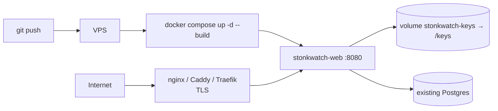

# Operations

## Local development

Prerequisites: .NET 10 SDK, Docker.

```bash
# 1. Postgres for development only
docker compose -f docker-compose.dev.yml up -d      # localhost:5432

# 2. Secrets (stored outside the repo, in the user profile)
cd src/StonkWatch.Web
dotnet user-secrets set "ConnectionStrings:StonkWatch" \
  "Host=localhost;Port=5432;Database=stonkwatch;Username=stonkwatch;Password=devpassword"
dotnet user-secrets set "Auth:Google:ClientId" "<from Google Cloud Console>"
dotnet user-secrets set "Auth:Google:ClientSecret" "<from Google Cloud Console>"
dotnet user-secrets set "Auth:AllowedEmail" "you@gmail.com"
dotnet user-secrets set "Auth:ApiKey" "<any random string>"

# 3. Schema + run
dotnet ef database update
dotnet run
```

Creating the Google OAuth client (one-time, in the
[Google Cloud Console](https://console.cloud.google.com/apis/credentials)):

1. Create a project (or reuse one), then **Create Credentials → OAuth client ID → Web
   application**.
2. Add an **Authorized redirect URI** for every environment that will sign in:
   - Local dev: `http://localhost:5264/signin-google` (or whatever port `dotnet run` binds)
   - Production: `https://your-vps-host/signin-google`
3. Copy the generated Client ID and Client secret into `Auth:Google:ClientId` /
   `Auth:Google:ClientSecret` above. `Auth:AllowedEmail` is the one Google account permitted
   to sign in — anyone else's Google login is rejected after the OAuth round-trip.

If `dotnet ef` is missing: `dotnet tool install --global dotnet-ef`.

## Configuration

All configuration comes from environment variables or `dotnet user-secrets`. In env vars,
`__` replaces `:` — `ConnectionStrings:StonkWatch` becomes `ConnectionStrings__StonkWatch`.

| Key | Required | Purpose |
|---|---|---|
| `ConnectionStrings:StonkWatch` | ✅ | Npgsql connection string. App fails fast at startup without it. |
| `Auth:Google:ClientId` | ✅ | OAuth client ID from Google Cloud Console |
| `Auth:Google:ClientSecret` | ✅ | OAuth client secret from Google Cloud Console |
| `Auth:AllowedEmail` | ✅ | The one Google account allowed to sign in; every other Google login is rejected |
| `Auth:ApiKey` | ✅ | Shared secret for `/api/*` and `/mcp` |
| `DataProtectionKeysPath` | in containers | Directory for cookie/antiforgery keys. Unset in a container ⇒ everyone is signed out on every restart. |

Nothing sensitive belongs in `appsettings.json` — it is committed.

### Price monitoring

All optional. **`Monitoring:Enabled` is `false` by default**, and with it off none of the rest
is read, no HTTP client is registered, and no worker runs — the app behaves exactly as it did
before the feature existed. That default also means a developer running locally can never
email anyone by accident.

| Key | Default | Purpose |
|---|---|---|
| `Monitoring:Enabled` | `false` | Master switch for the price-check worker |
| `Monitoring:IntervalMinutes` | `15` | Tick cadence |
| `Monitoring:IgnoreMarketHours` | `false` | Poll outside the session window. **Local testing only.** |
| `Monitoring:ReArmPercent` | `0.5` | How far past a level price must move before that alert can fire again |
| `Monitoring:MinNotifyHours` | `6` | Minimum gap between two emails about the same alert |
| `MarketData:ApiKey` | — | Twelve Data API key. Required when monitoring is on. |
| `MarketData:BaseUrl` | `https://api.twelvedata.com/` | |
| `MarketData:BatchSize` | `20` | Symbols per request. Batching is what keeps a 40-ticker list inside the free tier. |
| `Smtp:Host` / `Smtp:Port` | — / `587` | |
| `Smtp:Security` | `Auto` | `Auto`, `StartTls` (587), `SslOnConnect` (465), or `None` (local sink only) |
| `Smtp:Username` / `Smtp:Password` | — | A Gmail app password works |
| `Smtp:From` / `Smtp:To` | — | Required when monitoring is on |
| `App:PublicBaseUrl` | — | Absolute base URL for the links in alert emails, e.g. `https://stonks.example.com` |

`MarketData:*` and `Smtp:*` are validated **at startup** when monitoring is enabled, so a
missing API key or `From` address fails the deploy rather than the first tick.

Trying it locally without sending real email — run a throwaway mail sink and point at it:

```bash
docker run -d --name mailpit -p 1025:1025 -p 8025:8025 axllent/mailpit   # UI on :8025
dotnet user-secrets set "Monitoring:Enabled" "true"
dotnet user-secrets set "Monitoring:IntervalMinutes" "1"
dotnet user-secrets set "Monitoring:IgnoreMarketHours" "true"
dotnet user-secrets set "Smtp:Host" "localhost"
dotnet user-secrets set "Smtp:Port" "1025"
dotnet user-secrets set "Smtp:Security" "None"
```

## Deployment



1. Copy `.env.example` to `.env` and fill in real values. **Never commit `.env`.**
2. Give the container a route to Postgres — either publish Postgres's port and use it in
   `STONKWATCH_DB_CONNECTION_STRING`, or attach the `web` service to Postgres's Docker
   network (commented-out `networks:` block in `docker-compose.yml`) and use the container
   name as `Host=`.
3. Put a reverse proxy in front for TLS. The container serves plain HTTP on 8080 and trusts
   `X-Forwarded-*` from any source — only safe because it is never directly reachable.
4. `docker compose up -d --build`
5. Apply migrations (below).

### Applying migrations

Migrations are **not** applied at startup — that is deliberate, so a deploy can't silently
reshape the database.

```bash
# Option A — from your machine, pointed at the VPS database
dotnet ef database update --connection "Host=...;Database=stonkwatch;..."

# Option B — build a self-contained bundle and run it on the VPS
dotnet ef migrations bundle -o efbundle
./efbundle --connection "Host=...;Database=stonkwatch;..."
```

Order matters when a migration is destructive: apply the migration, then deploy the new
image. For additive migrations either order works.

## Runbook

| Symptom | Likely cause | Fix |
|---|---|---|
| Startup crash: `Connection string 'StonkWatch' is not configured` | `ConnectionStrings__StonkWatch` unset | Check `.env` is loaded by compose |
| Signed out after every restart | `DataProtectionKeysPath` unset or volume not mounted | Set it and mount `stonkwatch-keys:/keys` |
| `401` from `/api` or `/mcp` | Header name or value wrong | Header is exactly `X-Api-Key`; compare against `Auth:ApiKey` |
| "This Google account is not authorized" after sign-in | Email doesn't match `Auth:AllowedEmail` | Check the exact address you signed in with against the config value (case-insensitive) |
| `redirect_uri_mismatch` from Google | Redirect URI not registered for this client | Add `https://<host>/signin-google` (or `http://localhost:<port>/signin-google` locally) under **Authorized redirect URIs** in Google Cloud Console |
| Redirect loop to `/Account/Login` | Cookie dropped — proxy not forwarding `X-Forwarded-Proto` | Fix proxy headers; app needs to know the request was HTTPS |
| `column ... does not exist` | Migrations not applied to this database | Run `dotnet ef database update` against it |
| Timestamp write throws in Npgsql | Non-UTC `DateTimeOffset` reached a `timestamptz` column | `.ToUniversalTime()` before saving |
| MCP tool returns "an error occurred" | Domain exception not wrapped | Wrap the call in `Guarded()` |
| No alert emails at all | `Monitoring:Enabled` is false, or the worker never ticked | Dashboard badge shows the last run; `SELECT * FROM job_runs ORDER BY started_at DESC LIMIT 5` |
| Every run says "Market closed" | Working outside 09:30–16:00 ET, a weekend, or a holiday | Expected. Set `Monitoring:IgnoreMarketHours=true` only for local testing |
| Runs succeed, `candidates_checked` is 0 | Provider returned no prices — bad API key, exhausted quota, or unknown symbols | Check the logs for "Quote request rejected"; verify the ticker exists on Twelve Data |
| `job_runs.error` mentions a connection refusal | SMTP host/port wrong or unreachable | Alert rows are still saved and the email retries next tick; fix `Smtp:*` |
| Emails arrive but links 404 | `App:PublicBaseUrl` wrong or unset | Must be the external base URL, no trailing path |
| The same alert emails repeatedly | `Monitoring:MinNotifyHours` too low, or price is oscillating wider than `ReArmPercent` | Raise either, or acknowledge the alert to silence it |
| An alert never re-fires after clearing | Price has not moved `ReArmPercent` past the level | Lower `Monitoring:ReArmPercent` |
| `/healthz` returns 503 | Postgres unreachable | Check the connection string and that Postgres is up |

### Backups

Nothing is built in. The database is the only state — the container is disposable and the
key volume only holds session-signing keys. Back up Postgres:

```bash
docker exec <postgres-container> pg_dump -U stonkwatch stonkwatch | gzip > stonkwatch-$(date +%F).sql.gz
```

Losing the key volume signs you out; losing the database loses the watchlist.

### Logs

```bash
docker compose logs -f web
```

Default ASP.NET Core console logging only — there is no structured logging or metrics
endpoint. Two things do exist for unattended work:

- **`/healthz`** — anonymous, checks Postgres. Point the proxy or a monitor at it.
- **`job_runs`** — one row per worker tick, surfaced as a badge on the dashboard.

```sql
SELECT started_at, status, candidates_checked, alerts_fired, notifications_sent,
       skip_reason, error
FROM job_runs ORDER BY started_at DESC LIMIT 20;
```

### Enabling monitoring in production

1. Apply the migration first, then deploy the image.
2. Fill in `MarketData:*`, `Smtp:*` and `App:PublicBaseUrl` in `.env`, then set
   `Monitoring:Enabled=true` and restart.
3. Start at `Monitoring:IntervalMinutes=30` for the first day and read `job_runs` before
   tightening it — that is the cheapest way to catch a quota or credentials problem.
