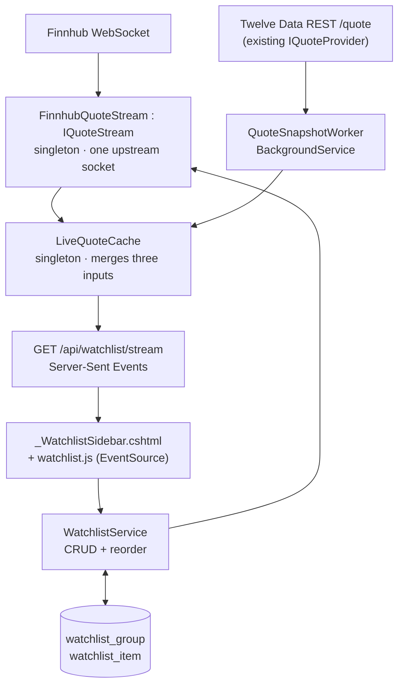

# Live Watchlist Sidebar — Design

**Date:** 2026-08-18
**Status:** Approved for planning
**Supersedes:** the "Feature 3 — Live watchlist" sketch in [tech-assessment.md](../../tech-assessment.md)

## Goal

A right-docked, always-present sidebar showing live prices for a user-curated symbol list,
organised into collapsible groups. TradingView's layout and density, rendered in StonkWatch's
existing dark palette.

## Non-goals

- **No link to `Candidate`.** The watchlist is its own thing. Nothing in this feature reads or
  writes `Candidate.LastQuote`, so the Tier 1 price-check worker keeps sole ownership of that
  column and the two systems cannot fight over it.
- **No charts, no sparklines, no `quote_history`.** Deferred.
- **No futures or forex.** No free tier covers them; committing now would mean permanently
  blank rows.
- **No multiple named watchlists.** One list with groups. The TradingView list switcher is
  deliberately dropped for a single-user tool.
- **No per-symbol logos.** No free data source provides them; rows use letter chips.
- **Rows are not clickable.** Deliberately deferred to a later step. The sidebar ships as a pure
  market-watching panel with no navigation out of it. Rows should still be built as semantic,
  focusable elements so adding a click target later is a change to behaviour, not to markup.

## 1. Provider decision

### The market at this budget

| Provider | Cost/mo | Real streaming? | Limits |
|---|---|---|---|
| **Finnhub Free** | **$0** | **Yes** — WebSocket trades | 50 symbols, 60 REST calls/min, personal-use licence |
| Alpaca Free | $0 | Yes, but **IEX feed only** | 30 symbols, 1 connection; REST is 15-min delayed |
| Twelve Data Basic *(in use today)* | $0 | No — 8 "trial" WS credits | 8 credits/min, 800/day. **Covers TSX.** |
| Finnhub Premium | $11.99+ | Yes | Cheapest paid tier found anywhere |
| Twelve Data Grow | $29 | No — still 8 trial WS credits | 55 credits/min |
| Tiingo Power | $30 | IEX websocket | 100k req/day |
| Twelve Data Pro | $99 | Yes — 500 WS credits/min | — |
| Massive (ex-Polygon) Advanced | $199 | Yes, consolidated | Starter/Developer are 15-min **delayed** |

**The $5–10/month band is empty.** Nothing between $0 and roughly $99 buys real streaming that
the free tiers do not already provide. Paying $30 for Tiingo or Twelve Data Grow would buy
strictly less than Finnhub's free tier for this use case.

**Decision: Finnhub free WebSocket as the live source, existing Twelve Data REST as the
snapshot source.** Alpaca was rejected because its IEX-only feed would make the Vol column
wrong by roughly 40x — a misread risk in a tool used for decisions, on par with the `302,53`
locale bug already recorded in CLAUDE.md.

### Why two providers rather than one

Verifying the APIs turned up the constraint that shapes the whole data layer: **Finnhub's trade
stream carries last price only.** The `v` field in a trade message is trade size, not cumulative
daily volume, and Finnhub's `/quote` has no volume field. Meanwhile Twelve Data's `/quote`
returns volume, previous close, and extended-hours fields — but only via REST, on a tight
credit budget.

So each column comes from where it is cheapest and most accurate:

| Column | Source | Cadence |
|---|---|---|
| **Last** | Finnhub WebSocket trade stream | Push, sub-second |
| **Chg%** | *Computed* — `(last − prevClose) / prevClose × 100` | Continuous, off every live tick |
| **Vol** | Twelve Data REST `/quote`, batched | Slow poll, ~10 min |
| **Ext** | Twelve Data REST extended-hours fields | Slow poll, ~10 min |

**Previous close only changes once per session.** Fetching it once (Finnhub `/quote`, `pc`
field) lets Chg% recompute off every live tick for free and stay exact. This is what makes the
feature fit free tiers: Twelve Data drops from "poll every 15 seconds" to "poll every 10
minutes for volume" — roughly 40 batched refreshes a day against an 800/day budget, instead of
blowing through it before lunch.

Only Vol is genuinely stale, and it is the column where ten-minute staleness matters least.

### The existing `Quote` record must be widened

`IQuoteProvider` currently returns `Quote(string Symbol, decimal Price, DateTimeOffset At)`.
Twelve Data's `/quote` response already contains `volume`, `previous_close`, `percent_change`
and the extended-hours fields — `TwelveDataQuoteProvider` simply discards them today. This
feature needs them, so `Quote` gains nullable fields:

```csharp
public record Quote(
    string Symbol, decimal Price, DateTimeOffset At,
    long? Volume = null,
    decimal? PreviousClose = null,
    decimal? ExtendedPrice = null,
    DateTimeOffset? ExtendedAt = null);
```

All additions are optional with defaults, so `PriceCheckJob` and `LevelEvaluator` — which read
`Price` only — are unaffected and their tests stay green. `TwelveDataQuoteProvider.TryParseQuote`
grows the corresponding parses, each tolerant of a missing field, using `InvariantCulture` for
the same reason the existing price parse does.

## 2. Data model

Two new tables. Both are additive; no existing table changes.

```csharp
public class WatchlistGroup
{
    public Guid Id { get; set; }
    public required string Name { get; set; }
    public int SortOrder { get; set; }
    public DateTimeOffset CreatedAt { get; set; }
    public List<WatchlistItem> Items { get; set; } = [];
}

public class WatchlistItem
{
    public Guid Id { get; set; }
    public Guid? GroupId { get; set; }          // null = ungrouped, renders above named groups
    public WatchlistGroup? Group { get; set; }
    public required string Symbol { get; set; } // normalised: trimmed, uppercase
    public string? DisplayName { get; set; }    // optional override for the row label
    public int SortOrder { get; set; }
    public DateTimeOffset CreatedAt { get; set; }
}
```

- Unique index on `WatchlistItem.Symbol` — one list, so a symbol appears once.
- Unique index on `WatchlistGroup.Name`.
- Deleting a group sets its items' `GroupId` to null rather than cascading; losing symbols
  because a group was renamed away would be surprising.
- No money columns, so the `HasPrecision` loop in `StonkWatchDbContext` is untouched.
- Snake-case table names come free from `UseSnakeCaseNamingConvention`.
- **Group collapse state is not persisted server-side.** It is a view preference and lives in
  `localStorage`.

### In-memory quote state (not persisted)

```csharp
public record LiveQuote(
    string Symbol,
    decimal? Last,            DateTimeOffset? LastAt,
    decimal? PreviousClose,   DateOnly? PreviousCloseSession,
    long?    Volume,          DateTimeOffset? VolumeAt,
    decimal? ExtendedPrice,   DateTimeOffset? ExtendedAt)
{
    public decimal? ChangePercent =>
        Last is { } last && PreviousClose is { } pc && pc != 0
            ? (last - pc) / pc * 100m
            : null;
}
```

`decimal` for prices per non-negotiable #4; all timestamps UTC. Nothing here touches Postgres,
so `timestamptz` rules do not apply, but keeping UTC avoids a conversion bug at the boundary.

## 3. Services

Four pieces, each with one job. Business logic stays in `Services/` per non-negotiable #1;
endpoints and the Razor partial are thin adapters and never see `StonkWatchDbContext`.



### `WatchlistService`

CRUD and reorder for items and groups. Normalises symbols on write (trim, uppercase). Throws
`ValidationException` / `ConflictException` per non-negotiable #5. Injects `TimeProvider`, never
`DateTimeOffset.UtcNow`, per #3.

On any change to the symbol set it notifies `IQuoteStream` to re-subscribe. Adding a 51st symbol
throws `ValidationException` naming the Finnhub cap rather than silently leaving a row blank.

### `IQuoteStream` / `FinnhubQuoteStream`

A new interface alongside the existing `IQuoteProvider`, not a replacement — the REST provider
is still needed for snapshots and is still what Tier 1 monitoring uses.

```csharp
public record Trade(string Symbol, decimal Price, DateTimeOffset At);

public interface IQuoteStream
{
    Task SetSymbolsAsync(IReadOnlyCollection<string> symbols, CancellationToken ct);
    IAsyncEnumerable<Trade> ReadAllAsync(CancellationToken ct);
}
```

Singleton holding **one** upstream WebSocket for the whole process, regardless of how many
browser tabs are open. Requirements:

- **Reconnect with exponential backoff.** A dropped socket must never kill the app or the loop,
  the same rule the docs already record for `PriceCheckWorker`.
- **Re-subscribe on reconnect.** Finnhub subscriptions are per-connection; a silent reconnect
  that forgets its symbols produces a permanently frozen sidebar with no error.
- **Message parsing is a pure function** over the JSON payload, mirroring how
  `TwelveDataQuoteProvider` is structured and tested today.
- **Closes outside market hours.** `MarketCalendar` already knows the sessions. Holding a socket
  open overnight buys nothing.
- The API key travels in the connection URL, so that URL must never be logged — the same hazard
  `TwelveDataQuoteProvider` already documents.

### `LiveQuoteCache`

Singleton, the single source of truth for "what is every symbol worth right now". Merges three
inputs into one row per symbol, each field carrying its own timestamp. **This is where the
interesting logic lives and it gets the heaviest tests.**

Merge rules:

1. A trade older than the stored `LastAt` is discarded. Out-of-order delivery must not rewind a
   price.
2. A snapshot never overwrites a `Last` that is newer than the snapshot's own timestamp. The
   slow REST poll must not stomp a fresh live tick.
3. `PreviousClose` is stamped with its session date. A previous close carried over from an
   earlier session is invalid and must be refetched, or Chg% silently reports against the wrong
   baseline all day.
4. `ChangePercent` is `null` — not zero — when `PreviousClose` is missing or zero. Rendering a
   fake `0.00%` in a markets tool is a misread risk.
5. Removing a symbol from the watchlist forgets its cache entry.

Fan-out to SSE subscribers uses `System.Threading.Channels`, one bounded channel per subscriber,
dropping oldest when full. A slow browser must not back-pressure the cache or the upstream
socket.

### `QuoteSnapshotWorker`

`BackgroundService` on a `PeriodicTimer`. Seeds previous closes at session start (Finnhub
`/quote`), then refreshes volume and extended-hours on the slow cadence (Twelve Data, batched
through the existing `IQuoteProvider`).

**It also owns the startup handshake.** On its first tick it reads the symbol list from
`WatchlistService` and hands it to `IQuoteStream.SetSymbolsAsync`. `WatchlistService` only
pushes *changes* thereafter, so without this the stream would sit subscribed to nothing until
the user happened to edit the list — a sidebar that is blank after every restart.

Follows the two rules the tech assessment already records: resolve a scope per tick via
`IServiceScopeFactory`, and never let the loop throw.

## 4. Transport and API surface

New `Endpoints/WatchlistEndpoints.cs`, following the shape of `CandidateEndpoints`.

| Method | Route | Purpose |
|---|---|---|
| GET | `/api/watchlist` | Groups, items, and current quotes — initial render |
| GET | `/api/watchlist/stream` | SSE; pushes changed rows only |
| POST | `/api/watchlist/items` | Add a symbol |
| PATCH | `/api/watchlist/items/{id}` | Three-way merge per non-negotiable #6 |
| DELETE | `/api/watchlist/items/{id}` | Remove a symbol |
| POST | `/api/watchlist/groups` | Create a group |
| PATCH | `/api/watchlist/groups/{id}` | Rename / reorder |
| DELETE | `/api/watchlist/groups/{id}` | Delete; items become ungrouped |
| POST | `/api/watchlist/reorder` | Bulk order update after a drag |

**Authorization differs from the existing API.** `/api/candidates` uses
`RequireAuthorization("ApiKey")`, but the sidebar runs in the browser with the existing session
cookie. The watchlist group needs a policy accepting **both** the cookie scheme and the API-key
scheme, so the sidebar works from a normal login and scripts still work with a key.

SSE uses .NET 10's native `TypedResults.ServerSentEvents`. *Verify the exact API surface at
implementation time — this is new in .NET 10 and unverified here.*

**The stream sends full current state on connect, then changed rows only.** Without the initial
burst, a symbol that happens not to trade for ten minutes after a page load would render blank —
the row would look broken rather than quiet. `GET /api/watchlist` and the stream's opening
frame therefore carry the same payload shape.

**The browser never talks to Finnhub or Twelve Data.** One upstream connection serves every open
tab, so the 50-symbol Finnhub cap constrains the watchlist size, not how many tabs are open, and
neither API key ever reaches page source. This is non-negotiable #7.

## 5. UI

`Pages/Shared/_WatchlistSidebar.cshtml`, rendered from `_Layout.cshtml` on every page.

- Right-docked, ~300px, collapsing to a narrow icon rail like the reference screenshot's right
  edge. Collapse state in `localStorage`.
- Plain JS (`wwwroot/js/watchlist.js`) with `EventSource` and targeted DOM patching. No
  framework — consistent with the standing "no SPA" decision.
- Columns: Symbol, Last, Chg%, Vol, Ext.
- **Night Desk palette, not TradingView's light theme.** Existing `--bull` / `--bear` /
  `--font-mono` tokens in `site.css` already say what a price panel needs; `IBM Plex Mono` gives
  tabular numerals so digits do not jitter on every tick.
- Flash-on-tick row highlight, green or red, decaying over ~600ms.
- Group headers: uppercase, `--ink-faint`, chevron to collapse.
- Letter chips tinted by group in place of logos.
- Footer states its own freshness: a live dot while streaming, `as of 14:32:05` otherwise. The
  tech assessment is explicit that the UI must state staleness rather than imply tick-by-tick,
  and with volume on a ten-minute cadence that matters more than usual.
- Prices render through the pinned `en-CA` culture, so no `302,53`.

Every page narrowing by 300px means the existing `.container` layouts need a check, particularly
the candidate form pages.

## 6. Configuration

Gated behind `LiveWatchlist:Enabled`, **off by default** — the same pattern and the same reason
as `Monitoring:Enabled`: a developer running locally should not open sockets or burn credits.
With it off, nothing in this design is registered.

```
LiveWatchlist:Enabled            false
LiveWatchlist:SnapshotMinutes    10
LiveWatchlist:MaxSymbols         50     # Finnhub free-tier cap
MarketData:Finnhub:ApiKey        (secret)
```

Finnhub's key goes in configuration beside the Twelve Data one. Never in `appsettings.json`,
never logged, never rendered.

## 7. Testing

Weighted where the risk is, following the existing suite's shape.

| Target | Kind | What it covers |
|---|---|---|
| `LiveQuoteCache` | Unit, `FakeTimeProvider` | All five merge rules. Out-of-order trades, snapshot-vs-live precedence, stale previous close across a session boundary, null Chg% when baseline is missing, forget-on-remove. **Highest value per line.** |
| Finnhub message parsing | Unit, pure | Trade payloads, multi-trade messages, ping frames, malformed JSON, unknown symbols. Mirrors `TwelveDataQuoteProviderTests`. |
| `FinnhubQuoteStream` reconnect | Unit, stubbed transport | Re-subscribes after a drop; backoff; never throws out of the loop. |
| `WatchlistService` | Integration, Testcontainers | CRUD, symbol normalisation, duplicate rejection, group delete orphans rather than cascades, reorder, `MaxSymbols` rejection. |
| Watchlist endpoints | `WebApplicationFactory` | Smoke tests including that cookie auth is accepted. |

The existing 172 tests stay green.

## 8. Build order

1. Probe Finnhub free-tier tick coverage with a throwaway key *(see Risks)*.
2. Entities + migration + `WatchlistService` + tests.
3. `LiveQuoteCache` + tests. Pure logic, no I/O, no provider needed.
4. `FinnhubQuoteStream` + parsing tests.
5. `QuoteSnapshotWorker` wiring Twelve Data snapshots in.
6. Endpoints, including SSE.
7. Sidebar partial, CSS, and `watchlist.js`.
8. Layout regression pass across every existing page.

Steps 2 and 3 are independent of the provider and can proceed regardless of what the probe finds.

## 9. Risks

- **Finnhub free-tier exchange coverage is unconfirmed.** Their docs page would not render
  during research. If the free trade feed turns out to be IEX-only like Alpaca's, live prices on
  thin names will be gappy. **Mitigation:** step 1 of the build order is a throwaway probe
  measuring real tick coverage on a liquid and an illiquid symbol before committing to code. If
  coverage is poor, the fallback is Twelve Data REST polling at 15–30s — the `IQuoteStream`
  abstraction makes that a one-implementation swap, and the cache, endpoints, and UI are
  unaffected.
- **Finnhub's free tier carries a personal-use licence.** Fine for a self-hosted single-user
  tool; would not survive this becoming a product.
- **No free tier offers real-time TSX.** Not a problem for the current US-listed candidates, but
  a Canadian symbol added to the watchlist will show snapshot data only. Twelve Data covers TSX
  via REST and would be the path if this becomes real.
- **The 50-symbol cap is a hard ceiling**, not a soft one. `WatchlistService` rejects the 51st
  symbol explicitly so the failure is legible rather than a silently blank row.
