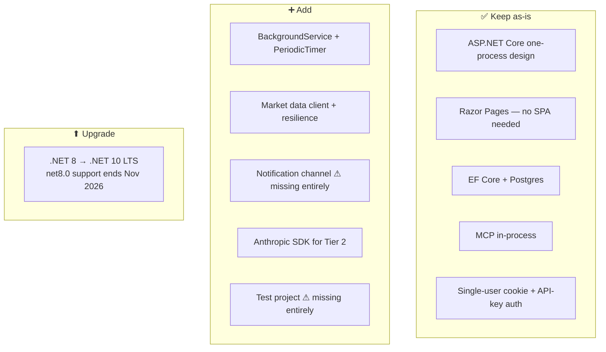
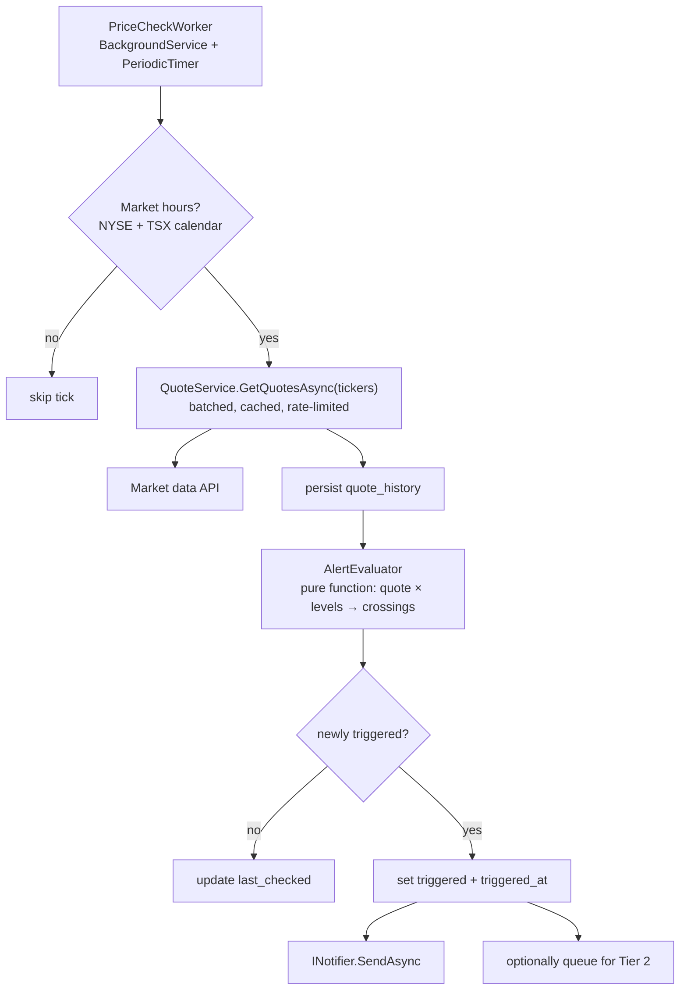
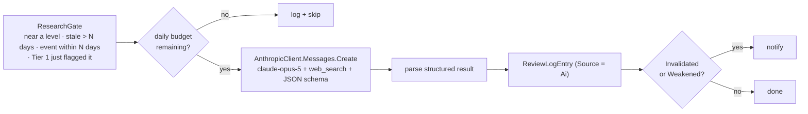
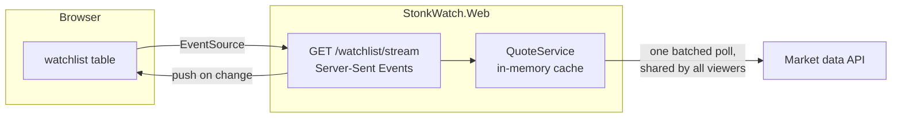
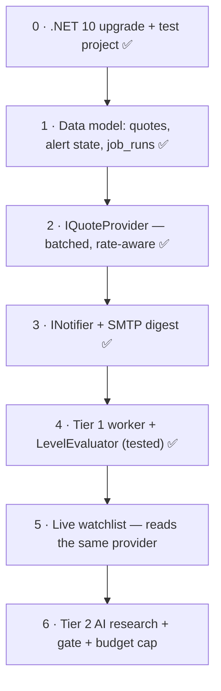

# Tech Assessment — Is the stack right for what's next?

Assessed against [next-features.md](../next-features.md): Tier 1 rule-based price checks,
Tier 2 AI research passes, and a live TradingView-style watchlist.

## Verdict

**The stack is right. Nothing needs replacing.** ASP.NET Core + Razor Pages + EF Core +
Postgres in one container comfortably carries all three features for a single-user tool.
What's needed is **additions**, plus fixing four gaps that will bite the moment work runs
unattended.



### At a glance

| Concern | Today | Needed | Verdict |
|---|---|---|---|
| Scheduling | `BackgroundService` + `PeriodicTimer` | — | **Done** — no Hangfire/Quartz needed at this scale |
| Market data | Twelve Data via `IHttpClientFactory` + resilience | — | **Done** — batched and rate-aware |
| Notifications | SMTP digest via MailKit, behind `INotifier` | — | **Done** |
| AI calls | none | official `Anthropic` NuGet SDK | **Add** — Tier 2, not yet started |
| Live UI | server-rendered forms | SSE or polled partial refresh | **Add** — still no SPA |
| Persistence | Postgres + EF Core, + `job_runs` and alert state | `quote_history` for charts | **Keep** |
| Tests | 172, xUnit + Testcontainers | more as features land | **Done** — harness in place |
| Runtime | `net10.0` | `net10.0` | **Done** — upgraded from `net8.0` (support ended Nov 2026) |

> **Status:** Tier 1 (rule-based price checks with email alerts) is built, tested and verified
> end-to-end. Tier 2 (AI research) and the live watchlist remain. The sections below are the
> original assessment; items marked *done* record what was actually built.

---

## Feature 1 — Tier 1 rule-based price checks

*A scheduled worker pulls prices every 15–30 min during market hours and compares them to
stored levels.*



**Scheduling — use `BackgroundService`, not a job framework.**

```csharp
public class PriceCheckWorker(IServiceScopeFactory scopes, TimeProvider time, ILogger<PriceCheckWorker> log)
    : BackgroundService
{
    protected override async Task ExecuteAsync(CancellationToken ct)
    {
        using var timer = new PeriodicTimer(TimeSpan.FromMinutes(15));
        while (await timer.WaitForNextTickAsync(ct))
        {
            using var scope = scopes.CreateScope();   // DbContext is scoped — never inject it here
            try { await scope.ServiceProvider.GetRequiredService<PriceCheckJob>().RunAsync(ct); }
            catch (Exception ex) { log.LogError(ex, "Price check failed"); }  // never let the loop die
        }
    }
}
```

Hangfire or Quartz would add a dashboard, persistent queues, and distributed locking — all
solving problems a single-instance personal tool doesn't have. Two things to get right
instead:

- **Scope per tick.** `BackgroundService` is a singleton; `DbContext` is scoped. Resolve
  through `IServiceScopeFactory` or you'll get a disposed-context error on the second tick.
- **Never let the loop throw.** One unhandled exception kills the worker silently for the
  life of the process.

> If you ever run more than one container, add a Postgres advisory lock
> (`SELECT pg_try_advisory_lock(...)`) around the tick so both instances don't fire the same
> alert. ~10 lines, cheaper than adopting a job framework preemptively.

**Market data.** No provider is wired up today — `next-features.md` mentions Twelve Data,
but there is no HTTP client anywhere in the codebase. Build it as one `QuoteService` used by
*all three* features:

```csharp
builder.Services.AddHttpClient<QuoteService>(c => c.BaseAddress = new Uri("https://api.twelvedata.com/"))
    .AddStandardResilienceHandler();   // Microsoft.Extensions.Http.Resilience
```

- **Batch.** Most providers accept comma-separated symbols on `/quote`. 40 tickers in one
  request instead of 40 requests is the difference between fitting in a free tier and not.
- **Respect the rate limit.** Twelve Data's free tier is roughly 8 requests/minute and 800
  per day — a 15-minute cadence over a 6.5-hour session is ~26 batched calls/day, which fits
  comfortably; 40 unbatched calls per tick does not.
- **Cache in memory** with a short TTL keyed by ticker. The live watchlist will hammer the
  same data; it should read the cache, never the provider.
- **The API key stays server-side.** Nothing about the provider is ever exposed to the browser.

**Alert evaluation must be a pure function.** Keep the crossing logic separate from the job
that fetches and persists:

```csharp
public static IReadOnlyList<AlertCrossing> Evaluate(decimal quote, decimal? previousQuote, Candidate c);
```

This is the one piece of genuinely tricky domain logic in the app — zone entry vs. level
crossing, direction, re-arming — and the one piece that must be unit-tested. Pure input →
output makes that trivial.

**De-duplication is the real design problem.** `Alert.Triggered` is a bare bool with no
timestamp. Fire naively and a ticker oscillating around its trigger sends a notification
every 15 minutes forever. Minimum viable rule: fire on the *transition* into a triggered
state, record `TriggeredAt`, and don't re-fire until price has left the zone by some margin
(`AcknowledgedAt` or a hysteresis band).

---

## Feature 2 — Tier 2 AI research pass

*For gated candidates, call Claude with web search, return structured JSON.*



**Use the official `Anthropic` NuGet SDK** — not hand-rolled HTTP.

```bash
dotnet add package Anthropic
```

```csharp
using Anthropic;
using Anthropic.Models.Messages;

var response = await client.Messages.Create(new MessageCreateParams
{
    Model = "claude-opus-5",
    MaxTokens = 8000,
    Thinking = new ThinkingConfigAdaptive(),
    OutputConfig = new OutputConfig
    {
        Effort = Effort.High,
        Format = new JsonOutputFormat { Schema = ResearchResultSchema },   // guarantees parseable JSON
    },
    Tools = [new ToolUnion(new WebSearchTool20260209())],                  // server-side; no loop to write
    System = [new TextBlockParam { Text = systemPrompt, CacheControl = new CacheControlEphemeral() }],
    Messages = [new() { Role = Role.User, Content = candidateContext }],
});
```

Four things that matter:

- **`claude-opus-5`** is the current model. Model IDs carry no date suffix.
- **Web search is a server tool** (`web_search_20260209`) — declare it and Claude runs the
  searches itself. There is no client-side tool loop to write. It is billed per search
  separately from tokens.
- **Structured output** via `OutputConfig.Format` with a JSON schema. This replaces the old
  "ask nicely for JSON and hope" pattern — the response is guaranteed to match the schema.
  Map it straight onto the existing `ThesisImpact` enum.
- **Prompt caching** on the system prompt. The instructions are identical across candidates;
  cache reads cost ~10% of input. Put the per-candidate context *after* the cached block.

**Cost is the design constraint, not capability.** At $5/$25 per million tokens, a research
pass with a few web searches lands roughly in the $0.10–0.20 range per candidate. Across 40
tickers daily that's meaningful monthly spend — which is exactly why `next-features.md`
gates it. Build the gate as an explicit, testable policy plus a hard daily cap, and record
per-run token usage so the real number replaces this estimate quickly. Choosing a cheaper
model is a decision to make with data, not upfront.

**Write results into the existing `review_log`.** An AI research pass *is* a review — it has
a date, a thesis impact, what changed, and a next action. Don't invent a parallel table; add
a `Source` enum (`Human` | `Ai`) and a nullable `Model` column so the UI can badge them and
you can filter.

**Two-tier gating is the right architecture** — the feature note already has this right.
Tier 1 is free arithmetic that catches most of what you'd want a ping for; Tier 2 is
expensive and runs only on candidates Tier 1 or staleness surfaced.

---

## Feature 3 — Live watchlist

*A TradingView-style live view.*

**Do not add a SPA framework.** The existing "server-rendered, no SPA" decision still holds —
one table refreshing every few seconds is not a React problem.



Two viable options:

| Approach | How | When to pick |
|---|---|---|
| **Polling** (start here) | `fetch('/api/quotes')` every 5–10s, swap a rendered partial | Simplest. ~30 lines of JS. Perfect for one user. |
| **SSE** | `IAsyncEnumerable` endpoint pushing `text/event-stream` | If you want sub-second feel without hammering the endpoint. Still no client library. |

SignalR is overkill — you need server→client only, no RPC, no reconnection semantics beyond
what `EventSource` gives free. Blazor Server would work but means rewriting working pages.

**Non-negotiable:** the browser talks to *your* server, which reads the shared quote cache.
It must never call the market data provider directly — that would leak the API key into page
source.

The free tier of most providers is REST-only; streaming WebSockets are a paid feature. So
"live" realistically means 5–15 second freshness during market hours. Design the UI to state
its own staleness (`as of 14:32:05`) rather than implying tick-by-tick.

---

## Data model changes required

Three of these block the features above; the fourth is for observability.

| Change | Why |
|---|---|
| **Split live quote from review price** — add `LastQuote` + `QuoteAt`, stop overloading `CurrentPrice` | Today the background job and `LogReviewAsync` would fight over one column. You lose the ability to answer "how far has it moved since I last looked", which is the whole point of `ReviewedPrice`. |
| **Alert firing state** — add `TriggeredAt`, `AcknowledgedAt`, `LastNotifiedAt` | A bare `Triggered` bool cannot express "fired at 10:04, I've seen it, don't tell me again". Without this the notifier spams. |
| **New table `quote_history`** — `(candidate_id, at, price)` | Needed for sparklines, for "crossed since last check" comparisons, and for any chart. Prune on a schedule; this is the only table that will actually grow. |
| **New table `job_runs`** — `(job, started_at, finished_at, status, items, error)` | Unattended work you can't see is work you can't trust. Surface the last run on the dashboard. |
| Add `Source` + `Model` to `review_log` | Distinguish AI-generated reviews from your own. |

All are additive migrations — no destructive change, no data loss.

---

## Cross-cutting gaps

### 1. ~~There is no way to notify anyone~~ — done (email)

Built as an SMTP digest via MailKit behind `INotifier`, one email per check cycle. The
options table below still stands if you ever want to swap channels — the interface is the
only thing a replacement has to satisfy.

<details>
<summary>Original assessment</summary>

The entire premise of Tier 1 is "catches what you'd actually want a ping for". There is no
ping. `Alert.Triggered` sets a flag that only appears if you happen to open the dashboard.

Add one interface and one implementation:

```csharp
public interface INotifier
{
    Task SendAsync(string title, string body, CancellationToken ct = default);
}
```

| Option | Effort | Notes |
|---|---|---|
| **[ntfy.sh](https://ntfy.sh)** | ~15 lines | HTTP POST to a topic URL. Phone push, no account, self-hostable. **Recommended.** |
| **Telegram bot** | ~20 lines | One HTTP call. Rich formatting, reliable delivery, works everywhere. |
| Email (SMTP) | moderate | Deliverability, SPF/DKIM, an SMTP dependency. Not worth it here. |
| Web push | high | Service worker, VAPID keys. Overkill for one user. |

Behind an interface, swapping later is a one-file change. Keep notification content dumb —
ticker, level crossed, price, link to the detail page.

</details>

### 2. ~~No tests~~ — done

`tests/StonkWatch.Web.Tests` — 172 tests, xUnit, with `Testcontainers.PostgreSql` for anything
touching the database and `FakeTimeProvider` for anything touching the clock. Coverage is
weighted where the plan said it should be: `LevelEvaluator` (every level type, both
directions, boundaries, gaps, first-run) and `PriceCheckJob` (suppression, re-arm, cooldown,
acknowledge, provider outage, failed email retry).

<details>
<summary>Original assessment</summary>

Zero test projects exist. That's defensible for CRUD scaffolding; it is not defensible once a
worker fires financial alerts unattended. The level-crossing logic is the highest-consequence
code in the app and cannot be verified by clicking around.

```bash
dotnet new xunit -o tests/StonkWatch.Web.Tests
dotnet add tests/StonkWatch.Web.Tests reference src/StonkWatch.Web
```

Priorities, in order:

1. `AlertEvaluator` — pure function, no database. Zone entry, level crossing, both
   directions, re-arm, nulls everywhere. **Highest value per line of test code.**
2. `EnumParsing` — the loose-parsing contract MCP depends on.
3. `CandidateService` PATCH semantics — the null/empty/value three-way merge.
4. Endpoint smoke tests via `WebApplicationFactory`.

`TimeProvider` is already injected everywhere, so `FakeTimeProvider`
(`Microsoft.Extensions.TimeProvider.Testing`) makes staleness and scheduling deterministic —
that design decision is already paying off. For database tests, `Testcontainers.PostgreSql`
gives a real Postgres per run; the EF in-memory provider will not reproduce `timestamptz` or
`numeric` behaviour and shouldn't be used here.

</details>

### 3. ~~.NET 8 support ends November 2026~~ — done

Upgraded to `net10.0` (the current LTS) before any of the new features landed, which is the
cheap moment to do it. The whole change was the target framework, the EF/Npgsql package
versions, the Docker base images, and one deprecated API
(`ForwardedHeadersOptions.KnownNetworks` → `KnownIPNetworks`). EF Core 10 produced no model
drift — `dotnet ef migrations has-pending-model-changes` reports none.

### 4. Observability — mostly done

Shipped with Tier 1:

- `/healthz` (anonymous, checks Postgres) for the proxy or an uptime monitor.
- `job_runs` — one row per tick with counts, skip reason and error, surfaced as a badge on
  the dashboard.

Still outstanding, and optional: structured logging (Serilog to console + rolling file) so
`docker compose logs` isn't the only forensic tool. You don't need OpenTelemetry, Prometheus,
or a dashboard stack for one user.

### 5. Things deliberately *not* recommended

| Suggestion | Why not |
|---|---|
| Hangfire / Quartz.NET | Solves distribution and persistence you don't have. `BackgroundService` is enough. |
| Redis | The in-memory cache is per-process and there is one process. |
| SignalR | SSE covers server→client push with no client library. |
| React / Blazor | The UI is forms and a table. Server-rendered wins on maintenance. |
| Message queue | No producer/consumer split, no cross-service boundary. |
| Multi-user auth / Identity | Explicit non-goal. Would touch every table. |
| Microservices | One process, one user, one database. Don't. |

---

## Suggested build order



Steps 0–4 are done. Step 5 should come next and is cheap now that `IQuoteProvider` exists —
which was the argument for building the quote layer as shared infrastructure rather than
burying it inside the Tier 1 worker. It will want the `quote_history` table for sparklines.

### What changed from the original plan while building

- **Notifications are driven by persisted alert state, not by the tick's crossings.** The
  first design stamped `last_notified_at` before sending, so a failed SMTP send lost the
  email permanently — a crossing cannot recur once `last_quote` moves past the level.
  Collecting from alert state instead makes a failed send retry on the next tick.
- **UI culture is pinned to `en-CA`.** Razor formats decimals with the host culture, and a
  French-locale host rendered a quote as `302,53`. In a markets app that is a misread risk,
  so the app now fixes its own culture rather than inheriting the server's.
- **Email links needed the real Razor route.** `/Candidates/Detail/{ticker}`, not
  `/Candidates/{ticker}` — caught only by clicking a link from a delivered email.
